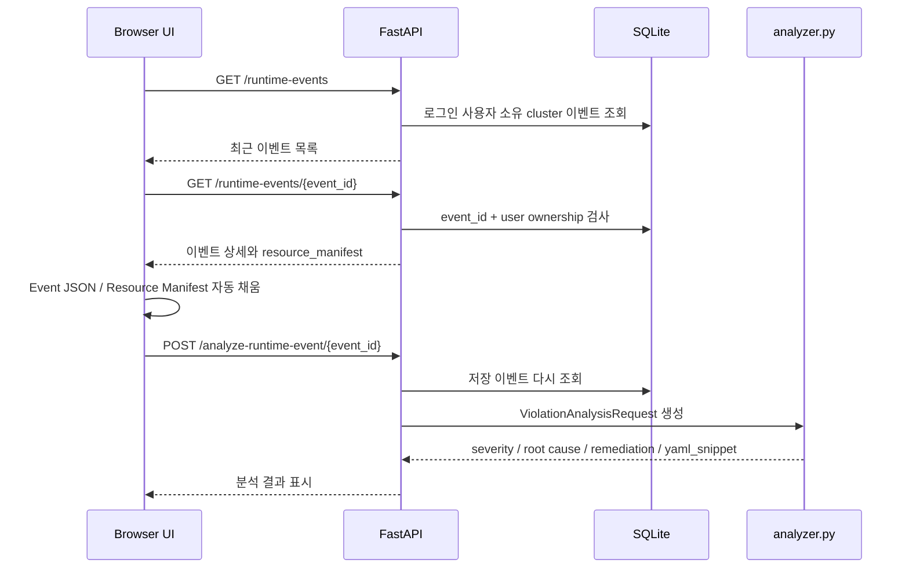
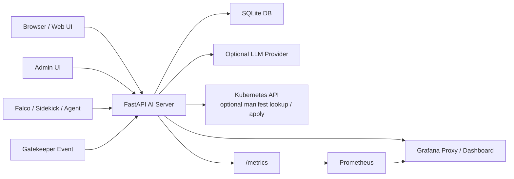

# KubeOwl Current-Code Architecture Defense Notes

> 이 문서는 예전 설명을 섞지 않고, 현재 repository의 실제 코드와 최근 커밋 기준으로 다시 작성한 발표 대비 문서입니다.
>
> 기준 코드:
> - `ai-observability/ai-server/app/static/index.html`
> - `ai-observability/ai-server/app/static/app.js`
> - `ai-observability/ai-server/app/static/admin.html`
> - `ai-observability/ai-server/app/static/docs.html`
> - `ai-observability/ai-server/app/main.py`
> - `ai-observability/ai-server/app/storage.py`
> - `ai-observability/ai-server/app/policy_generator.py`
> - `ai-observability/ai-server/app/analyzer.py`
> - `ai-observability/ai-server/app/runtime_client.py`
> - `ai-observability/ai-server/app/schemas.py`
> - `ai-observability/ai-server/tests/test_api.py`

## 1. 프로젝트 한 줄 설명

KubeOwl은 Kubernetes 보안 정책 생성, 사용자 클러스터 등록, Falco/Gatekeeper 이벤트 수집, 위반 상세 분석, AI Report, Grafana 연동, 관리자 감사를 하나의 FastAPI 기반 웹 콘솔로 묶은 컴플라이언스 운영 플랫폼입니다.

## 2. 절대 헷갈리면 안 되는 현재 코드 기준

### 2.1 Policy Generator에는 자유 prompt 입력창이 없습니다

현재 `/ui`의 Policy Generator 화면에는 사용자가 자연어 prompt를 직접 입력하는 textarea/input이 없습니다.

사용자가 화면에서 조작하는 값은 아래뿐입니다.

- `Policy Type`
- `EnforcementAction`
- `Constraint Name`
- `Allowed Registries`
- `Excluded Namespaces`
- `생성 결과 LLM 검토` 체크박스

코드 근거:

- `app/static/index.html`의 `<select id="policyKind">`
- `app/static/app.js`의 `POLICY_PROMPTS`
- `app/static/app.js`의 `generatePolicy()`

### 2.2 현재 UI에 노출된 정책은 6개뿐입니다

현재 `index.html`의 `policyKind` select와 `app.js`의 `POLICY_PROMPTS`에 있는 정책은 다음 6개입니다.

| UI value | 화면 표시 | 설명 |
|---|---|---|
| `latest-tag` | latest 태그 금지 | `:latest` 이미지 사용 제한 |
| `non-root` | non-root 강제 | root container 실행 제한 |
| `allowed-registries` | 레지스트리 제한 | 허용된 이미지 레지스트리만 사용 |
| `host-namespace` | host namespace 금지 | hostPID/hostIPC/hostNetwork 제한 |
| `security-context-mutation` | securityContext 자동 주입 | 보안 context 기본값 주입 |
| `resource-limits-mutation` | resource limits 자동 주입 | CPU/memory limit 기본값 주입 |

### 2.3 NetworkPolicy는 현재 Policy Generator 화면 기능으로 발표하면 안 됩니다

현재 UI에는 `network-policy` option이 없습니다. 따라서 발표에서 "Policy Generator가 NetworkPolicy도 생성한다"고 말하면 현재 화면과 맞지 않습니다.

주의할 점:

- `schemas.py`의 `PolicyKind`에는 아직 `"network-policy"`가 남아 있습니다.
- `policy_generator.py`에도 legacy/확장용 network-policy branch가 남아 있습니다.
- 하지만 `index.html`과 `app.js`가 현재 사용자에게 노출하는 정책 목록에는 없습니다.

따라서 발표 문장은 이렇게 해야 합니다.

> "현재 UI에서 사용자가 선택할 수 있는 Policy Generator 정책은 Gatekeeper Validate 4종과 Mutation 2종, 총 6개입니다. NetworkPolicy 관련 branch는 백엔드에 과거 확장 흔적으로 남아 있지만 현재 사용자-facing 기능으로는 노출하지 않습니다."

### 2.4 prompt 필드는 API 호환용 내부 값입니다

`PolicyGenerationRequest` schema는 아직 `prompt` 필드를 요구합니다.

하지만 사용자는 prompt를 입력하지 않습니다. 프론트엔드가 선택된 `policyKind`를 보고 내부 상수 `POLICY_PROMPTS[selectedPolicyKind]` 값을 `prompt`로 넣어 서버에 보냅니다.

즉:

- 사용자 자유 prompt UI: 없음
- 내부 canned prompt: 있음
- 최종 YAML 생성: LLM 자유 생성이 아니라 서버 템플릿 기반

## 3. 최근 커밋 기준 구현 요약

최근 주요 커밋:

```text
393f509 Improve runtime analysis UX and admin event metrics
6035dc8 Clarify architecture defense notes
```

### 3.1 TASK-01: LLM Violation Analysis UX 수정

수정 파일:

- `app/static/index.html`
- `app/static/app.js`
- `tests/test_api.py`

수정 내용:

1. Violation Detail 화면의 Event JSON textarea 초기 샘플 제거
2. Resource Manifest textarea 초기 샘플 제거
3. 초기 화면은 빈 textarea와 placeholder만 표시
4. `/runtime-events`에서 최근 이벤트 목록 로드
5. 이벤트 클릭 시 `/runtime-events/{event_id}`로 상세 조회
6. 선택된 이벤트 데이터로 Event JSON / Resource Manifest 자동 채움
7. Analyze 버튼 클릭 시 선택 이벤트가 있으면 `/analyze-runtime-event/{event_id}` 호출

현재 UX 흐름:



발표용 설명:

> "기존에는 샘플 JSON과 Manifest가 입력칸에 들어가 있어서 실제 이벤트 분석인지 데모 데이터인지 혼동될 수 있었습니다. 지금은 사용자가 최근 이벤트를 선택해야 데이터가 채워지고, 분석도 선택한 event_id 기준으로 실행됩니다."

### 3.2 TASK-02: Admin Dashboard 이벤트 메트릭 분리

수정 파일:

- `app/storage.py`
- `app/static/admin.html`
- `tests/test_api.py`

기존 문제:

- Admin user detail에서 이벤트 수가 하나의 `totalEvents`처럼 보였습니다.
- Gatekeeper Admission 이벤트와 Falco Runtime 이벤트를 구분하기 어려웠습니다.

수정 후:

```text
Gatekeeper(Admission)=X · Falco(Runtime)=Y
```

SQL 기준:

```sql
SUM(CASE WHEN events.source = 'gatekeeper' THEN 1 ELSE 0 END) AS gatekeeper_events
SUM(CASE WHEN events.source IN ('sidekick', 'falco-agent') THEN 1 ELSE 0 END) AS falco_events
```

중요한 판단:

- 구분 기준은 `action_taken`이 아닙니다.
- 구분 기준은 `events.source`입니다.

이유:

- `source`: 이벤트 출처입니다. Gatekeeper인지 Falco인지 구분합니다.
- `action_taken`: 이벤트 처리 결과입니다. 예를 들어 deny, alert_and_monitor 같은 대응 상태입니다.

발표용 설명:

> "Gatekeeper와 Falco는 발생 시점과 대응 방식이 다릅니다. Gatekeeper는 Admission 단계 정책 위반이고, Falco는 Runtime 탐지입니다. 그래서 관리자 화면에서 source 기준으로 둘을 분리했습니다."

## 4. 현재 전체 아키텍처



## 5. 주요 서버 파일 역할

| 파일 | 역할 |
|---|---|
| `main.py` | FastAPI route, auth, admin API, event ingest, policy API, static page serving |
| `storage.py` | SQLite schema, users/sessions/clusters/events/audit 저장과 조회 |
| `policy_generator.py` | Gatekeeper 정책 템플릿 생성, LLM review fallback |
| `analyzer.py` | Violation event 분석, severity/root cause/remediation/YAML snippet 생성 |
| `runtime_client.py` | runtime event normalize, manifest guidance, report, Kubernetes API helper |
| `llm_client.py` | OpenAI/Anthropic/Google/xAI provider client |
| `schemas.py` | Pydantic request/response model |
| `static/index.html` | 사용자 콘솔 UI |
| `static/app.js` | 사용자 콘솔 동작 |
| `static/admin.html` | 관리자 콘솔 UI |
| `static/docs.html` | 공개 문서 UI |

## 6. 현재 FastAPI 주요 endpoint

### 사용자 화면/인증

| Endpoint | 역할 |
|---|---|
| `GET /ui` | 사용자 콘솔 HTML |
| `GET /docs` | 공개 문서 HTML |
| `GET /admin` | 관리자 콘솔 HTML |
| `GET /config` | UI config |
| `GET /me` | 현재 로그인 사용자 |
| `GET /auth/google/login` | Google OAuth 시작 |
| `GET /auth/google/callback` | Google OAuth callback |
| `GET /auth/dev-login` | 개발/시연용 로그인 |
| `POST /logout` | 로그아웃 |

### Policy Generator

| Endpoint | 역할 |
|---|---|
| `POST /generate-policy` | 선택된 정책 유형 기반 Gatekeeper YAML 생성 |
| `POST /api/clusters/{cluster_id}/policy-applies` | 생성 정책 적용 또는 fallback command 제공 |

### Runtime Event / Analysis

| Endpoint | 역할 |
|---|---|
| `POST /ingest/falco-events` | Falco 이벤트 수집 |
| `POST /gatekeeper-events` | Gatekeeper 이벤트 수집 |
| `GET /runtime-events` | 최근 이벤트 목록 |
| `GET /runtime-events/{event_id}` | 이벤트 상세 |
| `GET /resource-manifest` | 저장 manifest 또는 kubectl guidance |
| `POST /analyze-runtime-event/{event_id}` | 저장 이벤트 ID 기반 분석 |
| `POST /analyze-violation` | 수동 payload 분석 fallback |
| `GET /compliance-report` | 이벤트 집계 report |

### Admin

| Endpoint | 역할 |
|---|---|
| `GET /admin/api/users` | 사용자 목록 |
| `GET /admin/api/users/{user_id}/clusters` | 사용자 상세 |
| `GET /admin/api/clusters` | 클러스터 목록 |
| `POST /admin/api/users/{user_id}/disable` | 사용자 정지 |
| `POST /admin/api/users/{user_id}/enable` | 사용자 정지 해제 |
| `POST /admin/api/users/{user_id}/restore` | 삭제 사용자 복구 |
| `GET /admin/api/audit-events` | 감사 로그 |
| `POST /admin/api/cleanup` | 오래된 record cleanup |

## 7. SQLite 저장 구조

`storage.py`에서 lazy initialization으로 SQLite schema를 생성합니다.

기본 경로:

```text
/tmp/compliance-ai-server.sqlite3
```

Kubernetes 배포 시:

```text
SQLITE_PATH=/data/compliance-ai-server.sqlite3
```

주요 테이블:

| Table | 역할 |
|---|---|
| `users` | 사용자 |
| `sessions` | 세션 token hash |
| `clusters` | 사용자 소유 클러스터 |
| `events` | Falco/Gatekeeper 이벤트 |
| `policy_apply_history` | 정책 적용 이력 |
| `user_slack_settings` | Slack webhook 설정 |
| `grafana_provisioning` | Grafana org/datasource/dashboard 정보 |
| `auth_login_events` | 로그인 abuse 감지 |
| `audit_events` | 관리자/사용자 중요 작업 감사 로그 |

`events` 테이블에서 발표 때 중요한 컬럼:

| Column | 의미 |
|---|---|
| `source` | `gatekeeper`, `sidekick`, `falco-agent` 등 이벤트 출처 |
| `cluster_id` | 사용자 소유 클러스터 연결 |
| `rule` | Falco rule 또는 Gatekeeper constraint |
| `severity` | 내부 심각도 |
| `namespace` | Kubernetes namespace |
| `pod_name` | 대상 Pod |
| `resource_manifest` | 분석에 사용할 manifest snapshot |
| `raw_event_json` | 원본 이벤트 |

## 8. Policy Generator 현재 구현

### 8.1 화면 기준 정책 6개

현재 화면에서 선택 가능한 정책은 모두 Gatekeeper 정책입니다.

| 정책 | 종류 |
|---|---|
| latest 태그 금지 | Gatekeeper Validate |
| non-root 강제 | Gatekeeper Validate |
| 레지스트리 제한 | Gatekeeper Validate |
| host namespace 금지 | Gatekeeper Validate |
| securityContext 자동 주입 | Gatekeeper Mutation |
| resource limits 자동 주입 | Gatekeeper Mutation |

### 8.2 LLM 역할

LLM은 최종 YAML 생성자가 아닙니다.

현재 구조:

1. UI에서 정책 유형 선택
2. `app.js`가 내부 canned prompt와 `policy_kind` 생성
3. `/generate-policy` 호출
4. `policy_generator.py`가 템플릿 기반 YAML 생성
5. `use_llm`이 켜져 있으면 생성 결과를 LLM으로 review
6. LLM 실패 시 템플릿 YAML은 유지

발표용 문장:

> "LLM에게 최종 YAML을 자유 생성하게 하지 않았습니다. Kubernetes 정책은 잘못 만들면 운영 장애가 생길 수 있기 때문에, 서버가 제한된 템플릿으로 YAML을 만들고 LLM은 검토 보조로만 사용합니다."

## 9. Violation Analyzer 현재 구현

관련 파일:

- `analyzer.py`
- `classifier.py`
- `runtime_client.py`
- `app.js`

분석 결과에 포함되는 주요 값:

| Field | 의미 |
|---|---|
| `severity` | low / medium / high |
| `reason` | 분류 근거 |
| `confidence` | 신뢰도 |
| `summary` | 요약 |
| `severity_explanation` | 심각도 설명 |
| `root_cause` | 원인 |
| `recommended_fix` | 수정 권고 |
| `remediation` | 운영 조치 |
| `yaml_snippet` | 수정 YAML 예시 |
| `llm_used` | LLM 사용 여부 |
| `llm_error` | LLM 실패/fallback 메시지 |

LLM 사용 시 redaction 대상:

- token / password / secret / api key
- private IP
- private registry host
- namespace
- env value

## 10. Admin Dashboard 현재 구현

관련 파일:

- `static/admin.html`
- `storage.py`
- `main.py`

사용자 상세에서 클러스터별 이벤트를 다음처럼 보여줍니다.

```text
Gatekeeper(Admission)=0 · Falco(Runtime)=3
```

이 표시 값은 `storage.list_clusters(user_id=...)`가 반환하는 `gatekeeper_events`, `falco_events`를 사용합니다.

Zero event 사용자도 깨지지 않도록 `cluster.gatekeeper_events || 0`, `cluster.falco_events || 0` fallback을 사용합니다.

## 11. 인증과 권한

### 사용자 인증

- Google OAuth
- dev login
- 세션 쿠키 이름: `compliance_ai_session`
- 세션 token은 hash로 저장

### 관리자 인증

- `X-Admin-Token`
- 환경변수 `ADMIN_TOKEN`
- 일반 사용자 세션과 admin token은 분리

### 사용자 이벤트 격리

런타임 이벤트 조회는 `user_id`로 제한합니다.

예:

```text
events.cluster_id IN (SELECT id FROM clusters WHERE user_id = ?)
```

따라서 다른 사용자의 event id를 알아도 상세 조회할 수 없습니다.

## 12. AI 사용을 교수님께 설명하는 방식

방어적으로 숨기기보다 이렇게 말하는 것이 좋습니다.

> "AI coding assistant를 구현 보조로 사용했습니다. 하지만 제가 한 일은 요구사항을 정하고, 위험한 범위를 제한하고, 어떤 기능을 사용자에게 노출할지 결정하고, 테스트로 검증한 것입니다. 예를 들어 Policy Generator에서 자유 prompt UI를 제거하고 정책 유형 선택식으로 제한한 점, Violation Detail을 선택 이벤트 기반으로 바꾼 점, Admin 메트릭을 Gatekeeper/Falco source 기준으로 분리한 점은 제가 정한 설계 기준입니다."

짧게:

> "AI는 구현 속도를 높이는 도구였고, 저는 요구사항 정의, 보안상 제한, 통합 방식 선택, 검증 기준을 담당했습니다."

## 13. 예상 질문과 답변

### Q1. Policy Generator에서 NetworkPolicy도 만들 수 있나요?

현재 UI 기준으로는 아닙니다. 현재 화면에 노출된 정책은 Gatekeeper Validate 4종과 Mutation 2종, 총 6개입니다. 백엔드 schema와 generator에 `network-policy` 흔적이 남아 있지만 현재 사용자-facing 기능으로 발표하지 않는 것이 정확합니다.

### Q2. 왜 자유 prompt를 제거했나요?

Prompt injection과 hallucination 위험을 줄이기 위해서입니다. 사용자가 아무 문장이나 넣으면 LLM 또는 분류 로직이 예상 밖 정책을 만들 수 있습니다. 그래서 현재 UI는 정책 유형 선택식이고, 서버는 제한된 템플릿으로만 YAML을 생성합니다.

### Q3. Gatekeeper와 Falco는 무엇이 다른가요?

Gatekeeper는 Admission 단계에서 Kubernetes 리소스 생성/수정을 검사합니다. Falco는 Runtime 단계에서 syscall 기반 이상행위를 탐지합니다. 즉 Gatekeeper는 배포 전/정책 위반, Falco는 실행 중 보안 이벤트입니다.

### Q4. 왜 Admin에서 이벤트 수를 둘로 나눴나요?

운영자가 Admission 문제인지 Runtime 문제인지 바로 구분해야 하기 때문입니다. 두 이벤트는 원인과 대응 방식이 다르므로 total 하나보다 Gatekeeper/Falco 분리 메트릭이 더 유용합니다.

### Q5. 왜 `action_taken`이 아니라 `source`로 나눴나요?

`source`는 이벤트 출처이고, `action_taken`은 대응 결과입니다. Gatekeeper/Falco 구분은 출처 기준이어야 하므로 `source`가 맞습니다.

### Q6. LLM이 실패하면 어떻게 되나요?

정책 생성은 템플릿 결과가 유지되고, 위반 분석은 규칙 기반 fallback이 표시됩니다. LLM 실패가 빈 화면이나 기능 중단으로 이어지지 않게 설계했습니다.

### Q7. 사용자가 선택하지 않은 이벤트를 분석할 수 있나요?

현재 UX는 이벤트 선택을 기본 흐름으로 합니다. Event JSON/Manifest는 초기에는 비어 있고, 최근 이벤트를 클릭하면 채워집니다. 선택된 이벤트가 있으면 `/analyze-runtime-event/{event_id}`가 호출됩니다.

## 14. 10분 발표 목차 구성 예시

대본이 아니라 발표 슬라이드/화면 구성 기준입니다. 10분 안에 너무 많은 코드를 설명하려고 하지 말고, "문제 → 구조 → 직접 구현/판단 → 검증 → 한계" 순서로 가는 것이 좋습니다.

| 시간 | 목차 | 보여줄 내용 | 핵심 메시지 |
|---:|---|---|---|
| 0:00-0:50 | 1. 문제 정의 | Kubernetes 보안 운영에서 정책 위반과 런타임 이벤트가 따로 흩어지는 문제 | "정책 생성, 이벤트 수집, 분석, 관리자를 한 흐름으로 묶고 싶었다" |
| 0:50-1:40 | 2. 프로젝트 목표 | KubeOwl 기능 목록: Policy Generator, Cluster Setup, Violation Detail, AI Report, Admin | "단순 정책 YAML 생성기가 아니라 운영 콘솔을 만들었다" |
| 1:40-2:50 | 3. 전체 아키텍처 | FastAPI, SQLite, Web UI, Admin UI, Falco/Gatekeeper, LLM, Grafana 다이어그램 | "FastAPI가 BFF처럼 UI/API/저장을 통합한다" |
| 2:50-4:00 | 4. Policy Generator | 실제 UI 화면. Policy Type 6개만 보여주기 | "자유 prompt는 제거했고, 선택식 Gatekeeper 정책 6개만 노출한다" |
| 4:00-5:20 | 5. Runtime Event Flow | `/runtime-events` 목록, 이벤트 클릭, JSON/Manifest 자동 채움 | "샘플 데이터가 아니라 사용자가 선택한 저장 이벤트 기준으로 분석한다" |
| 5:20-6:20 | 6. Analyze Flow | `/analyze-runtime-event/{event_id}` API 흐름 | "event_id와 user ownership을 기준으로 안전하게 분석한다" |
| 6:20-7:20 | 7. Admin Metrics | Admin user detail의 Gatekeeper(Admission), Falco(Runtime) 분리 표시 | "source 기준으로 Admission 문제와 Runtime 문제를 구분한다" |
| 7:20-8:10 | 8. LLM 사용 원칙 | LLM review, violation analysis, redaction, fallback | "LLM은 최종 권한자가 아니라 보조 분석자다" |
| 8:10-9:00 | 9. 내가 직접 결정한 부분 | 자유 prompt 제거, 6개 정책 제한, event_id 기반 분석, source 기준 집계 | "AI 도움을 받았지만 요구사항과 안전장치는 내가 정했다" |
| 9:00-10:00 | 10. 검증과 한계 | pytest 결과, 남은 한계: legacy network-policy branch, SQLite, Gatekeeper ingest auth | "현재 동작은 검증했고, 다음 개선 방향도 알고 있다" |

### 발표에서 실제로 보여주면 좋은 화면 순서

1. `/ui` 첫 화면
2. Policy Generator 탭: prompt 입력창이 없고 정책 6개만 있는 부분
3. Violation Detail 탭: Event JSON / Resource Manifest 빈 상태
4. 최근 이벤트 클릭 후 JSON / Manifest가 채워진 상태
5. Analyze 결과
6. `/admin` 사용자 상세: Gatekeeper(Admission), Falco(Runtime) 분리 표시
7. 마지막에 테스트 명령 또는 Git commit 화면

### 10분 발표에서 빼도 되는 내용

- `llm_client.py` provider별 HTTP payload 세부 구조
- Grafana proxy 내부 구현 세부
- Slack webhook 세부
- 전체 DB schema 모든 컬럼
- legacy `network-policy` branch 구현 설명

질문이 들어오면 답하면 되지만, 본 발표 시간에는 핵심 흐름을 먼저 보여주는 편이 좋습니다.

## 15. [Demo Guide] 화면 조작 순서

발표자는 아래 순서대로 화면을 움직이면 됩니다. 코드를 설명하지 말고, "운영자가 실제로 어떤 흐름으로 쓰는지"를 보여주는 것이 목표입니다.

### 데모 시작 전 준비

- 브라우저에서 KubeOwl `/ui`를 열어 둔다.
- 로그인 상태를 미리 확인한다. 데모 계정 또는 Google OAuth 중 하나를 사용한다.
- Violation Detail에 보여줄 최근 Falco/Gatekeeper 이벤트가 최소 1개 이상 있도록 준비한다.
- LLM API key를 사용할 경우 BYOK 영역에서 provider와 key를 미리 적용해 둔다.
- `/admin`도 다른 탭에 열어 두고 admin token 입력 상태를 준비한다.
- 네트워크가 불안정하면 Grafana 화면은 생략하고 KubeOwl UI 중심으로 진행한다.

### Step 1. Cluster Setup: 클러스터 등록과 Falco Sidekick 설치 명령

- `/ui`에서 Cluster Setup 또는 내 클러스터 영역으로 이동한다.
- 등록된 클러스터 목록을 보여준다.
- 새 클러스터 등록 또는 기존 클러스터의 설치 명령 영역을 보여준다.
- Falco Sidekick Helm install command가 자동으로 생성된다는 점을 짚는다.
- 토큰이 포함된 명령이므로 외부 공유하면 안 된다는 점을 한 문장으로 말한다.

보여줄 핵심:

- "KubeOwl은 중앙 서버가 사용자 클러스터를 구분할 수 있도록 cluster token을 발급한다."
- "Falco Sidekick은 이 token을 이용해 `/ingest/falco-events`로 runtime event를 보낸다."

### Step 2. Policy Generator: 배포 전 방어

- Policy Generator 탭으로 이동한다.
- Policy Type dropdown을 열어 6개 정책만 보여준다.
- prompt 입력창이 없다는 것을 화면으로 보여준다.
- 예시로 `latest 태그 금지` 또는 `non-root 강제`를 선택한다.
- EnforcementAction은 `dryrun` 또는 `warn`을 먼저 보여준다.
- `정책 생성` 버튼을 누른다.
- ConstraintTemplate / Constraint YAML 결과를 보여준다.
- LLM 검토를 켤 경우, "LLM은 YAML 생성자가 아니라 리뷰어"라고 설명한다.

보여줄 핵심:

- "정책은 자유 prompt가 아니라 선택식 template으로 생성된다."
- "OPA Gatekeeper가 Admission 단계에서 잘못된 resource 배포를 막는다."
- "잘못된 정책의 blast radius가 크기 때문에 UI를 일부러 제한했다."

### Step 3. Violation Detail: 배포 후 런타임 탐지

- Violation Detail 탭으로 이동한다.
- Event JSON과 Resource Manifest가 처음에는 비어 있거나 선택 이벤트 기준으로 채워지는 구조라고 설명한다.
- 최근 이벤트 목록에서 Falco runtime event 하나를 클릭한다.
- Event JSON textarea가 자동으로 채워지는 것을 보여준다.
- Resource Manifest가 있으면 함께 채워지는 것을 보여준다.
- `LLM으로 원인/수정 YAML 생성`을 켤 수 있으면 켠다.
- `상세 분석` 버튼을 누른다.
- 분석 결과에서 severity, root cause, recommended fix, YAML snippet 영역을 보여준다.

보여줄 핵심:

- "복잡한 Falco/Gatekeeper 로그를 운영자가 읽을 수 있는 조치 문장으로 바꾼다."
- "선택된 event_id를 기준으로 `/analyze-runtime-event/{event_id}`가 실행된다."
- "LLM 사용 전 backend redaction pipeline으로 민감 정보가 마스킹된다."

### Step 4. Admin Dashboard: 운영자 관점 확인

- `/admin` 탭으로 이동한다.
- 사용자 목록에서 데모 사용자를 선택한다.
- 사용자 상세 영역에서 클러스터 목록과 이벤트 메트릭을 보여준다.
- `Gatekeeper(Admission)`과 `Falco(Runtime)`이 분리되어 표시되는 것을 강조한다.

보여줄 핵심:

- "Admission 단계 문제와 Runtime 단계 문제를 하나의 total로 섞지 않는다."
- "source 컬럼 기준으로 Gatekeeper와 Falco를 분리했다."

### Step 5. 마무리 검증

- 시간이 남으면 테스트 명령 또는 최근 commit을 보여준다.
- 시간이 부족하면 테스트 화면은 말로만 언급한다.

보여줄 핵심:

- "기능은 화면만 만든 것이 아니라 pytest와 JS syntax check로 검증했다."

## 16. [Spoken Script] 10분 발표 대본

아래는 실제 발표에서 말할 수 있는 자연스러운 한국어 대본입니다. 시간은 약 10분 기준입니다.

### 1. Goal: 무엇을 왜 만들었는가 (0:00-3:00)

안녕하세요. 저는 Kubernetes 컴플라이언스 운영을 돕기 위한 ComplianceOps 플랫폼, KubeOwl을 발표하겠습니다.

클라우드 네이티브 환경에서는 보안 도구 자체가 부족한 것은 아닙니다. CNCF 생태계에는 Falco, OPA Gatekeeper, Prometheus, Grafana처럼 좋은 도구들이 이미 많이 있습니다. 문제는 이 도구들을 실제 운영 환경에서 함께 적용하는 과정이 복잡하다는 점입니다.

예를 들어 Gatekeeper는 배포 전에 잘못된 Kubernetes 리소스를 막아 주고, Falco는 배포 이후 컨테이너 내부에서 발생하는 runtime 이상행위를 탐지합니다. 그런데 운영자 입장에서는 정책 YAML은 따로 관리해야 하고, runtime log는 또 다른 화면에서 봐야 하고, Grafana metric은 별도로 확인해야 합니다. 이벤트가 많아지면 어떤 경고가 중요한지 판단하기 어렵고, 결국 alert fatigue가 생깁니다.

KubeOwl은 이 문제를 해결하기 위해 만든 중앙형 ComplianceOps 플랫폼입니다. 단순히 보안 이벤트를 보여주는 도구가 아니라, 배포 전 Admission Control과 배포 후 Runtime Detection을 하나의 운영 흐름으로 묶는 것이 목표입니다.

핵심 가치는 세 가지입니다.

첫째, OPA Gatekeeper를 이용해 배포 전에 위험한 리소스를 막습니다. 둘째, Falco를 이용해 배포 이후 실행 중인 컨테이너의 이상행위를 탐지합니다. 셋째, 복잡한 위반 로그와 manifest를 LLM 보조 분석으로 운영자가 이해할 수 있는 원인과 수정 가이드로 바꿉니다.

중요한 점은 LLM을 모든 것을 결정하는 자동화 엔진으로 쓰지 않았다는 것입니다. KubeOwl에서 LLM은 보조 분석자입니다. 정책 생성이나 보안 판단의 최종 책임은 서버의 제한된 템플릿, 사용자 선택, 그리고 운영자 검토 흐름 안에 둡니다.

### 2. Demo & Implementation: 어떻게 동작하는가 (3:00-6:00)

이제 실제 사용자 흐름 기준으로 보여드리겠습니다.

먼저 클러스터 등록 단계입니다. 운영자는 KubeOwl 콘솔에서 자신의 Kubernetes 클러스터를 등록합니다. 등록이 되면 KubeOwl은 해당 클러스터를 식별하기 위한 token과 Falco Sidekick 설치 명령을 생성합니다.

이 명령은 Helm 기반으로 Falco Sidekick을 설치하거나 설정하는 흐름에 사용됩니다. 여기서 중요한 점은, 사용자 클러스터의 runtime event가 중앙 KubeOwl 서버의 `/ingest/falco-events` endpoint로 들어오고, 서버는 cluster token을 통해 어느 사용자의 어느 클러스터에서 온 이벤트인지 구분한다는 점입니다.

두 번째는 배포 전 방어입니다. Policy Generator 화면을 보시면, 사용자가 자유롭게 prompt를 입력하는 칸이 없습니다. 대신 정책 유형을 선택하는 dropdown이 있습니다. 현재 UI에서 노출하는 정책은 6개입니다. latest 태그 금지, non-root 강제, 레지스트리 제한, host namespace 금지, securityContext 자동 주입, resource limits 자동 주입입니다.

제가 이 UX를 선택한 이유는 Kubernetes 정책의 blast radius가 크기 때문입니다. 잘못된 정책 YAML 하나가 정상 workload 배포를 막거나 시스템 namespace에 영향을 줄 수 있습니다. 그래서 LLM에게 자유롭게 정책 YAML을 만들게 하지 않고, 사용자는 사전 정의된 정책 유형을 선택하고, 서버가 검증된 template으로 Gatekeeper YAML을 생성하도록 했습니다.

생성된 결과는 바로 클러스터에 무조건 적용되는 것이 아니라, 먼저 ConstraintTemplate과 Constraint YAML로 노출됩니다. 운영자는 YAML을 확인하고, dryrun이나 warn 같은 낮은 위험 단계부터 검토할 수 있습니다.

세 번째는 배포 후 탐지입니다. Violation Detail 화면에서는 최근 runtime event 목록을 볼 수 있습니다. 처음부터 샘플 JSON이 들어가 있는 구조가 아니라, 운영자가 실제 이벤트를 클릭해야 Event JSON과 Resource Manifest가 채워집니다.

이벤트를 클릭하면 프론트엔드는 `/runtime-events/{event_id}`를 호출해 저장된 이벤트 상세를 가져옵니다. 그리고 Analyze 버튼을 누르면 `/analyze-runtime-event/{event_id}` API를 호출합니다. 즉, 사용자가 화면에서 임의로 붙여 넣은 샘플이 아니라, 서버에 저장된 실제 event_id를 기준으로 분석합니다.

분석 결과에는 severity, 원인 설명, 권장 조치, 그리고 적용 가능한 remediation YAML snippet이 표시됩니다. 운영자는 복잡한 Falco 로그나 Gatekeeper 위반 메시지를 직접 해석하지 않아도, 어떤 리소스에서 어떤 문제가 발생했고 어떻게 수정해야 하는지 한 화면에서 확인할 수 있습니다.

### 3. Engineering Decisions & Troubleshooting: 왜 이렇게 설계했는가 (6:00-9:00)

이 프로젝트에서 제가 가장 신경 쓴 부분은 단순히 기능을 붙이는 것이 아니라, AI를 어디까지 믿고 어디서 제한할지 결정하는 것이었습니다.

첫 번째 경험은 UX와 보안 사이의 trade-off입니다. 처음에는 사용자가 자연어로 "이런 정책 만들어줘"라고 입력하고 LLM이 YAML을 만들어 주는 방식도 생각할 수 있었습니다. 하지만 저는 이 방향을 선택하지 않았습니다.

Kubernetes 정책은 일반 웹 텍스트와 다르게 잘못 생성되었을 때 영향 범위가 큽니다. 예를 들어 root 금지 정책이 시스템 namespace까지 잘못 적용되면 CNI, storage driver, monitoring component 같은 필수 workload가 영향을 받을 수 있습니다. 그래서 저는 자유 prompt UX를 제거하고, 6개의 사전 정의 정책 template만 dropdown으로 노출했습니다.

현재 backend schema에는 호환을 위해 `prompt` 필드가 남아 있지만, 사용자는 prompt를 직접 입력하지 않습니다. 프론트엔드가 선택된 policy type을 내부 canned prompt로 변환해 서버에 보내고, 서버는 `policy_kind` 기준으로 template YAML을 생성합니다. LLM은 생성된 결과를 검토하는 reviewer 역할로만 제한했습니다.

두 번째 경험은 LLM으로 인한 데이터 유출 위험입니다. Runtime event를 분석하려면 Event JSON뿐 아니라 Resource Manifest도 같이 보는 것이 좋습니다. 그래야 어떤 namespace, pod, container, image에서 문제가 생겼는지 더 정확히 알 수 있습니다.

하지만 manifest에는 민감한 정보가 들어갈 수 있습니다. private registry URL, internal IP, secret-like token, 환경변수 값 같은 정보가 포함될 수 있습니다. 이런 데이터를 그대로 public LLM API에 보내면 보안 분석 기능이 오히려 정보 유출 경로가 될 수 있습니다.

그래서 backend에 redaction pipeline을 두었습니다. LLM으로 보내기 전에 token, password, secret, api key 같은 값은 `[REDACTED_SECRET]`으로 바꾸고, private IP나 private registry, 민감한 namespace 정보도 마스킹합니다. 이렇게 하면 LLM이 분석에 필요한 구조적 맥락은 볼 수 있지만, 민감한 원문 값은 외부로 나가지 않습니다.

세 번째로, Admin Dashboard에서도 운영 판단을 쉽게 하기 위해 이벤트를 분리했습니다. 단순히 total event count만 보여주면, 문제가 Admission 단계의 정책 위반인지 Runtime 단계의 침해 탐지인지 알기 어렵습니다. 그래서 `events.source` 기준으로 Gatekeeper(Admission)과 Falco(Runtime)를 나누었습니다.

여기서도 중요한 판단이 있었습니다. 저는 `action_taken`이 아니라 `source`를 기준으로 잡았습니다. `action_taken`은 deny나 alert 같은 대응 결과이고, `source`는 이벤트가 어디서 왔는지 나타냅니다. Gatekeeper와 Falco를 구분하려면 출처 기준인 `source`가 맞습니다.

### 4. Conclusion: 마무리 (9:00-10:00)

정리하면, KubeOwl은 CNCF 보안 도구들을 따로따로 쓰는 어려움을 줄이고, 정책 생성, runtime event 수집, AI 보조 분석, 관리자 관측을 하나의 ComplianceOps 흐름으로 연결하는 플랫폼입니다.

제가 배운 점은 AI를 붙이는 것 자체보다, AI를 어디까지 제한할지 설계하는 것이 더 중요하다는 점입니다. 사용자 경험을 좋게 만들고 싶지만, Kubernetes 보안 정책은 잘못되면 영향 범위가 큽니다. 그래서 자유 prompt 대신 제한된 template을 선택했고, LLM 분석에는 redaction pipeline을 넣었습니다.

또한 4-core 8GB 같은 제한된 환경에서는 모든 것을 대규모 분산 시스템처럼 만들 수 없습니다. 그래서 SQLite, 단일 FastAPI 서버, 정적 UI, 선택적 LLM 호출처럼 단순한 구조를 유지하면서도, 사용자 소유권 격리와 운영자 검토 흐름은 지키려고 했습니다.

결국 KubeOwl의 핵심은 자동화와 통제 사이의 균형입니다. CNCF 도구의 강점을 활용하되, 운영자가 이해하고 검토할 수 있는 형태로 낮추는 것이 이 프로젝트의 목표입니다.

## 17. 발표 전 체크리스트

1. `/ui` 접속
2. Policy Generator에 prompt 입력창이 없는지 확인
3. Policy Type이 6개인지 확인
4. NetworkPolicy option이 없는지 확인
5. Violation Detail의 Event JSON / Resource Manifest가 처음에 비어 있는지 확인
6. 최근 이벤트 클릭 시 값이 채워지는지 확인
7. Analyze 클릭 시 결과가 뜨는지 확인
8. `/admin` 사용자 상세에서 Gatekeeper(Admission), Falco(Runtime)가 따로 보이는지 확인
9. `pytest` 핵심 테스트 통과 확인

## 18. 검증 명령

```bash
.venv/bin/python -m pytest \
  ai-observability/ai-server/tests/test_api.py::test_ui_is_served \
  ai-observability/ai-server/tests/test_api.py::test_docs_is_served \
  ai-observability/ai-server/tests/test_api.py::test_admin_dashboard_lists_users_and_event_counts \
  ai-observability/ai-server/tests/test_api.py::test_runtime_analysis_uses_stored_manifest_snapshot \
  -q
```

```bash
node --check ai-observability/ai-server/app/static/app.js
```

## 19. 현재 한계와 개선 방향

발표에서 한계로 말하기 좋은 내용입니다.

- `schemas.py`와 `policy_generator.py`에 legacy `network-policy` branch가 남아 있으므로, UI scope와 backend schema를 완전히 정리하면 더 깔끔합니다.
- SQLite는 데모와 단일 인스턴스에는 단순하지만, 대규모 운영은 PostgreSQL이 더 적합합니다.
- Gatekeeper event ingest 인증은 Falco ingest token 흐름만큼 강화할 필요가 있습니다.
- Admin filter는 현재 필수는 아니지만, 나중에 source/severity/rule 기준 필터를 추가할 수 있습니다.
- LLM 결과는 계속 schema validation과 redaction을 강화해야 합니다.
