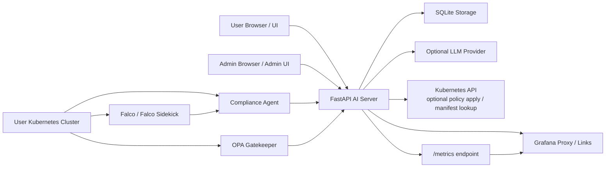
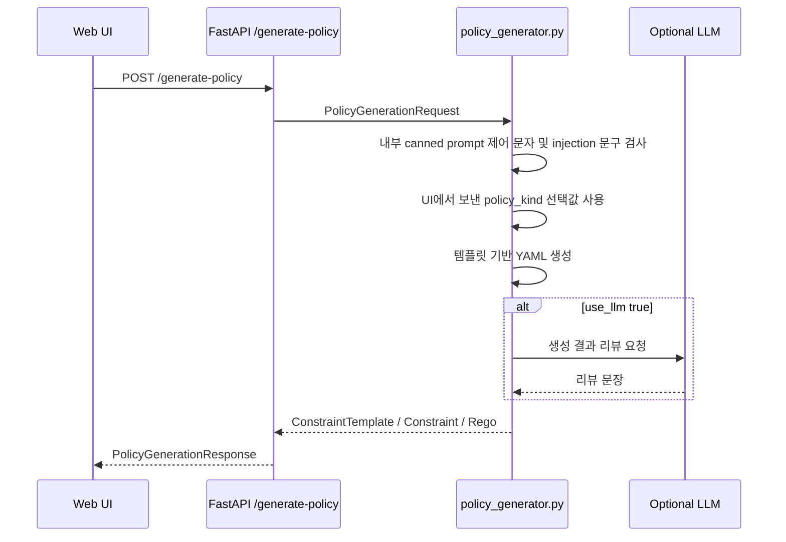
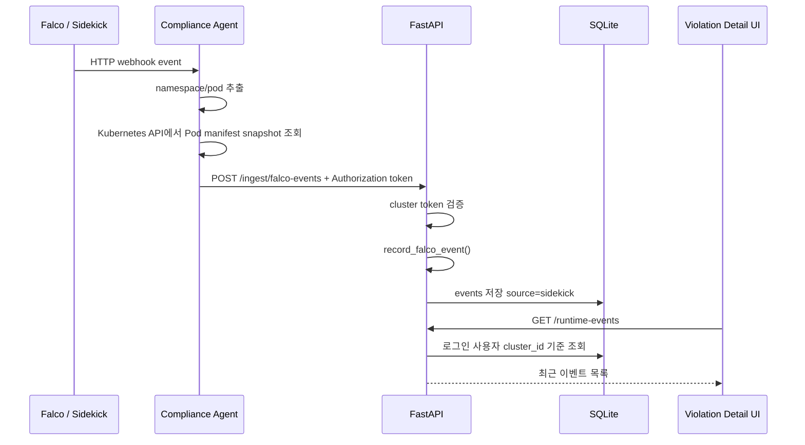
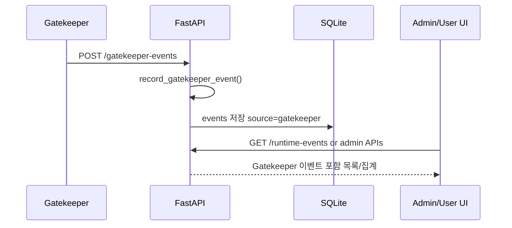
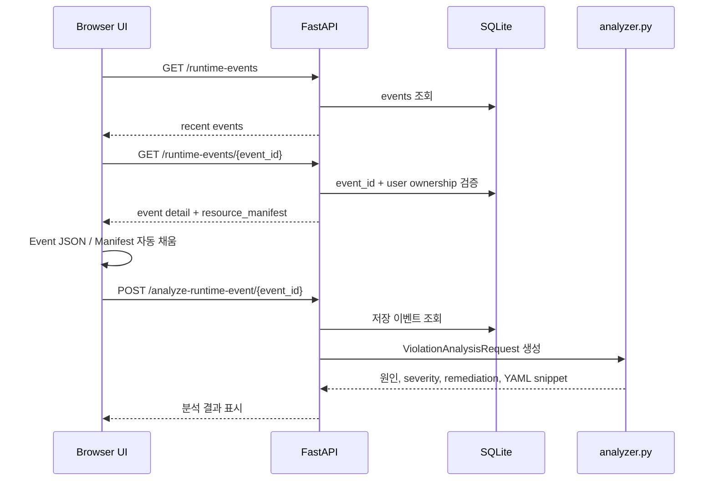

# KubeOwl Project Architecture and Presentation Defense Notes

> 발표 대비 목적: 교수님이 "이 프로젝트에서 무엇을 만들었는가?", "어떤 구조인가?", "AI가 도와줬다면 본인은 무엇을 했는가?"를 물었을 때 설명할 수 있도록 정리한 문서입니다.

## 1. 한 문장 요약

KubeOwl은 Kubernetes 클러스터에서 정책 위반과 런타임 보안 이벤트를 수집하고, Gatekeeper 정책 생성, Falco 이벤트 분석, LLM 보조 분석, Grafana 관측, 관리자 감사 기능을 하나의 웹 콘솔로 연결한 Policy-as-Code 기반 컴플라이언스 플랫폼입니다.

## 1.1 현재 코드 기준 중요 정정

이 문서는 현재 코드 기준으로 다시 맞춘 버전입니다. 발표할 때 특히 아래 내용을 혼동하지 않아야 합니다.

### Policy Generator에는 사용자 자유 prompt 입력창이 없습니다

현재 `/ui`의 Policy Generator 화면에는 사용자가 자연어 prompt를 직접 입력하는 textarea/input이 없습니다. 사용자는 아래 값만 선택하거나 입력합니다.

- Policy Type
- EnforcementAction
- Constraint Name
- Allowed Registries
- Excluded Namespaces
- 생성 결과 LLM 검토 여부

다만 backend API `PolicyGenerationRequest`는 기존 호환 때문에 아직 `prompt` 필드를 요구합니다. 그래서 `app/static/app.js`는 사용자가 선택한 `policyKind`를 내부 상수 `POLICY_PROMPTS`의 canned prompt로 변환해 `/generate-policy`에 보냅니다.

즉, 발표에서 이렇게 설명해야 합니다.

> "사용자 자유 prompt UI는 제거했습니다. Prompt injection 위험을 줄이기 위해 사용자는 정책 유형을 선택하고, 프론트엔드는 그 선택값을 내부 canned prompt와 `policy_kind`로 서버에 전달합니다. 최종 YAML은 LLM 자유 생성이 아니라 서버 템플릿으로 만듭니다."

### 현재 최근 수정 사항

- TASK-01: Violation Detail의 Event JSON / Resource Manifest 초기 샘플을 제거했습니다.
- TASK-01: `/runtime-events`에서 이벤트 목록을 가져오고, 이벤트 클릭 시 `/runtime-events/{event_id}`로 상세를 불러옵니다.
- TASK-01: 선택 이벤트가 있으면 Analyze 버튼이 `/analyze-runtime-event/{event_id}`를 호출합니다.
- TASK-02: Admin user detail에서 `totalEvents` 단일 표시 대신 `Gatekeeper(Admission)`과 `Falco(Runtime)`를 분리 표시합니다.
- TASK-02: 분리 기준은 `action_taken`이 아니라 `events.source`입니다.

## 2. 내가 발표에서 말할 핵심 성과

이 프로젝트에서 만든 결과물은 단순한 YAML 모음이 아니라, 다음 흐름을 하나로 연결한 운영형 플랫폼입니다.

1. 사용자가 웹 UI에서 보안 정책을 선택한다.
2. 서버가 Gatekeeper 정책 YAML을 템플릿 기반으로 생성한다.
3. 사용자가 자기 Kubernetes 클러스터를 등록하고 ingest token을 발급받는다.
4. Falco 또는 Gatekeeper에서 발생한 위반 이벤트를 중앙 서버로 수집한다.
5. 이벤트를 SQLite에 저장하고 사용자/클러스터 소유권으로 격리한다.
6. Violation Detail 화면에서 이벤트를 선택하면 Event JSON과 Resource Manifest가 자동으로 채워진다.
7. Analyze 버튼을 누르면 선택된 이벤트 ID 기준으로 `/analyze-runtime-event/{event_id}` API가 실행된다.
8. 관리자 화면에서는 사용자별, 클러스터별 이벤트 수를 Gatekeeper와 Falco로 분리해서 볼 수 있다.
9. Grafana/Prometheus 메트릭과 admin audit 기능으로 운영 상태를 확인한다.

## 3. AI 도움을 받은 부분을 정직하게 설명하는 방법

교수님이 "AI가 대부분 만들었냐?"라고 물으면 방어적으로 숨기기보다 이렇게 말하는 것이 좋습니다.

> "코드 작성 과정에서 AI coding assistant를 적극적으로 사용했습니다. 하지만 제가 한 일은 단순 복사가 아니라, Kubernetes 보안 도메인의 요구사항을 정하고, Gatekeeper/Falco/LLM/Grafana/SQLite를 어떤 흐름으로 연결할지 선택하고, 생성된 코드를 검토하면서 동작 기준과 완료 조건을 정한 것입니다. 특히 LLM이 최종 정책을 마음대로 만들지 않게 템플릿 기반으로 제한하고, 이벤트 분석은 저장된 event_id 기준으로 실행되도록 바꾸고, 관리자 메트릭은 source 컬럼 기준으로 Gatekeeper와 Falco를 분리하도록 요구사항을 정의했습니다."

조금 더 짧게 말하면:

> "AI는 구현 속도를 높이는 도구로 사용했고, 저는 요구사항 정의, 아키텍처 선택, 기능 범위 제한, 테스트 기준, 보안/운영 판단을 담당했습니다."

절대 말하지 않는 것이 좋은 표현:

- "AI가 다 해줬고 저는 잘 모릅니다."
- "그냥 추천 나온 대로 했습니다."
- "코드는 모르지만 돌아갑니다."

대신 이렇게 말해야 합니다:

- "AI가 제안한 코드 중 프로젝트 목표에 맞는 방향을 선택했습니다."
- "사용자 자유 prompt UI는 제거했고, 정책 유형 선택값만 서버로 보냅니다."
- "이벤트 ingestion, DB schema, admin auth 같은 위험한 범위는 이번 작업에서 건드리지 않도록 scope를 제한했습니다."
- "테스트와 API 응답 기준으로 동작을 확인했습니다."

## 4. 전체 아키텍처



### 구성요소 역할

| 구성요소 | 위치 | 역할 |
|---|---|---|
| FastAPI AI Server | `ai-observability/ai-server/app/main.py` | API, 인증, 정적 UI, 이벤트 분석, 정책 생성, admin 기능 |
| Web UI | `app/static/index.html`, `app/static/app.js` | 사용자 콘솔. 정책 생성, 클러스터 등록, 이벤트 선택/분석 |
| Admin UI | `app/static/admin.html` | 관리자 콘솔. 사용자/클러스터/이벤트/감사 관리 |
| SQLite Storage | `app/storage.py` | users, sessions, clusters, events, policy history, audit events 저장 |
| Policy Generator | `app/policy_generator.py` | Gatekeeper 정책 YAML 템플릿 생성 및 LLM 검토 |
| Violation Analyzer | `app/analyzer.py` | Falco/Gatekeeper 이벤트 심각도, 원인, 조치 분석 |
| Runtime Client | `app/runtime_client.py` | 이벤트 정규화, report 생성, Kubernetes API 연동 |
| LLM Client | `app/llm_client.py` | OpenAI/Anthropic/Google/xAI compatible client |
| Compliance Agent | `compliance-agent/` | 사용자 클러스터에서 Falco 이벤트와 manifest snapshot 전송 |
| Runtime Detection | `runtime-detection/` | Falco, response-server, HMAC signing proxy, runtime response 실험 모듈 |
| Policy Engine | `k8s-policy-engine/` | Gatekeeper ConstraintTemplate, Constraint, Mutation 정책 원본 |
| Grafana Dashboards | `ai-observability/dashboards/` | 관측 대시보드 JSON/ConfigMap |

## 5. 주요 디렉터리 구조

```text
k8s-compliance-platform/
├── README.md
├── ai-observability/
│   ├── ai-server/
│   │   ├── app/
│   │   │   ├── main.py
│   │   │   ├── storage.py
│   │   │   ├── policy_generator.py
│   │   │   ├── analyzer.py
│   │   │   ├── classifier.py
│   │   │   ├── llm_client.py
│   │   │   ├── runtime_client.py
│   │   │   ├── schemas.py
│   │   │   ├── grafana/
│   │   │   └── static/
│   │   │       ├── index.html
│   │   │       ├── app.js
│   │   │       ├── admin.html
│   │   │       └── styles.css
│   │   └── tests/
│   ├── dashboards/
│   └── docs/
├── compliance-agent/
├── runtime-detection/
├── k8s-policy-engine/
└── cloud-deploy/
```

## 6. FastAPI 서버 구조

핵심 서버는 `ai-observability/ai-server/app/main.py`입니다.

### 공개/사용자 라우트

| API | 역할 |
|---|---|
| `GET /healthz` | 서버 health check |
| `GET /config` | Grafana URL, auth 설정 등 UI config 제공 |
| `GET /ui` | 사용자 콘솔 HTML |
| `GET /docs` | 공개 문서 페이지 |
| `GET /me` | 현재 로그인 사용자 정보 |
| `GET /auth/google/login` | Google OAuth 시작 |
| `GET /auth/google/callback` | Google OAuth 콜백 |
| `GET /auth/dev-login` | 개발/시연용 로그인 |
| `POST /logout` | 로그아웃 |
| `POST /api/account/delete` | 사용자 계정 삭제 |

### 정책 생성/적용 라우트

| API | 역할 |
|---|---|
| `POST /generate-policy` | 사용자의 정책 요청을 Gatekeeper YAML로 변환 |
| `POST /api/clusters/{cluster_id}/policy-applies` | 생성된 정책을 클러스터에 적용하거나 fallback kubectl 명령 제공 |

### 런타임 이벤트 라우트

| API | 역할 |
|---|---|
| `POST /ingest/falco-events` | Falco Sidekick/agent 이벤트 수집 |
| `POST /gatekeeper-events` | Gatekeeper deny/audit 이벤트 수집 |
| `GET /runtime-events` | 최근 런타임 이벤트 목록 조회 |
| `GET /runtime-events/{event_id}` | 특정 이벤트 상세 조회 |
| `GET /resource-manifest` | 이벤트와 연결된 manifest 또는 kubectl guidance 조회 |
| `POST /analyze-runtime-event/{event_id}` | 저장된 이벤트 ID 기준 상세 분석 |
| `POST /analyze-violation` | 수동 JSON 기반 분석 fallback |
| `GET /compliance-report` | 이벤트 집계 기반 AI report 생성 |

### 사용자 클러스터/Slack/Grafana 라우트

| API | 역할 |
|---|---|
| `GET /api/clusters` | 로그인 사용자의 클러스터 목록 |
| `POST /api/clusters` | 클러스터 등록 및 token 발급 |
| `POST /api/clusters/{cluster_id}/rotate-token` | ingest token 재발급 |
| `DELETE /api/clusters/{cluster_id}` | 클러스터 휴지통 처리 |
| `POST /api/clusters/{cluster_id}/restore` | 클러스터 복구 |
| `GET /api/slack-settings` | Slack 설정 조회 |
| `POST /api/slack-settings` | Slack webhook 저장 |
| `POST /api/slack-settings/test` | Slack 테스트 알림 |
| `POST /api/clusters/{cluster_id}/grafana/provision` | 사용자별 Grafana org/datasource/dashboard provision |

### 관리자 라우트

| API | 역할 |
|---|---|
| `GET /admin` | 관리자 콘솔 HTML |
| `GET /admin/api/users` | 사용자 목록 |
| `GET /admin/api/users/{user_id}/clusters` | 사용자 상세 및 클러스터 목록 |
| `GET /admin/api/clusters` | 전체 클러스터 목록 |
| `POST /admin/api/users/{user_id}/disable` | 사용자 정지 |
| `POST /admin/api/users/{user_id}/enable` | 사용자 정지 해제 |
| `POST /admin/api/users/{user_id}/restore` | 삭제 사용자 복구 |
| `POST /admin/api/clusters/{cluster_id}/disable` | 클러스터 비활성화 |
| `POST /admin/api/clusters/{cluster_id}/enable` | 클러스터 활성화 |
| `DELETE /admin/api/clusters/{cluster_id}` | 클러스터 휴지통 |
| `DELETE /admin/api/clusters/{cluster_id}/permanent` | 클러스터 영구 삭제 |
| `GET /admin/api/audit-events` | 감사 이벤트 조회 |
| `POST /admin/api/cleanup` | 오래된 record 정리 |

## 7. 데이터베이스 구조

SQLite는 `app/storage.py`에서 lazy initialization 방식으로 생성됩니다.

기본 DB 파일:

```text
/tmp/compliance-ai-server.sqlite3
```

환경변수로 변경 가능:

```text
SQLITE_PATH=/path/to/file.sqlite3
```

### 주요 테이블

| 테이블 | 역할 |
|---|---|
| `users` | 로그인 사용자 정보 |
| `sessions` | 로그인 세션 token hash |
| `clusters` | 사용자 소유 Kubernetes 클러스터 |
| `events` | Falco/Gatekeeper 런타임 이벤트 |
| `policy_apply_history` | 정책 적용 이력 |
| `user_slack_settings` | 사용자 Slack webhook |
| `slack_notification_state` | Slack 중복 알림 방지 상태 |
| `grafana_provisioning` | 사용자/클러스터별 Grafana org/datasource/dashboard 정보 |
| `auth_login_events` | 로그인 abuse 방지용 이벤트 |
| `audit_events` | 관리자/사용자 중요 작업 감사 로그 |

### events 테이블 핵심 컬럼

| 컬럼 | 의미 |
|---|---|
| `id` | 이벤트 ID |
| `source` | 이벤트 출처. `gatekeeper`, `sidekick`, `falco-agent` 등 |
| `cluster_id` | 소유 클러스터 ID |
| `cluster` | 클러스터 이름 |
| `cluster_kind` | `customer`, `demo`, `source`, `legacy` |
| `timestamp` | 이벤트 발생 시각 |
| `rule` | Falco rule 또는 Gatekeeper constraint |
| `priority` | 원본 priority |
| `severity` | 내부 severity |
| `namespace` | Kubernetes namespace |
| `pod_name` | 대상 Pod |
| `container_name` | 컨테이너 |
| `image` | 이미지 |
| `user_name` | 이벤트 사용자 |
| `command` | 실행 명령 |
| `action_taken` | 대응 상태. 예: `deny`, `alert_and_monitor` |
| `resource_manifest` | 이벤트 당시 리소스 manifest snapshot |
| `raw_event_json` | 원본 이벤트 JSON |

### source 기준 이벤트 분리

관리자 화면의 Gatekeeper/Falco 분리는 `action_taken`이 아니라 `source` 기준입니다.

```sql
SUM(CASE WHEN events.source = 'gatekeeper' THEN 1 ELSE 0 END) AS gatekeeper_events
SUM(CASE WHEN events.source IN ('sidekick', 'falco-agent') THEN 1 ELSE 0 END) AS falco_events
```

왜 `action_taken`이 아닌가?

- `source`는 이벤트가 어디서 왔는지 나타냅니다.
- `action_taken`은 그 이벤트에 대해 어떤 조치를 했는지 나타냅니다.
- Gatekeeper/Falco 구분 목적에는 `source`가 더 정확합니다.

## 8. 인증과 권한 구조

### 사용자 인증

지원 방식:

1. Google OAuth
2. 개발/시연용 dev login

세션 쿠키:

```text
compliance_ai_session
```

세션은 raw token을 DB에 저장하지 않고 hash로 저장합니다.

### 관리자 인증

Admin API는 `X-Admin-Token` 헤더 또는 Bearer token을 사용합니다.

환경변수:

```text
ADMIN_TOKEN=...
```

관리자 인증은 일반 사용자 세션과 분리되어 있습니다.

### 사용자 데이터 격리

런타임 이벤트 조회는 로그인 사용자 소유 클러스터로 제한됩니다.

예:

```python
storage.get_event(event_id, user_id=user["id"])
```

이렇게 하면 다른 사용자의 이벤트 ID를 알아도 상세 조회할 수 없습니다.

## 9. 정책 생성 구조

정책 생성은 `app/policy_generator.py`가 담당합니다. 현재 사용자 화면에는 자유 prompt textarea가 없습니다. 사용자는 정책 유형, enforcementAction, 정책 이름, 허용 레지스트리, 제외 네임스페이스만 선택/입력합니다.

다만 backend API schema에는 여전히 `prompt` 필드가 남아 있습니다. 이는 기존 `/generate-policy` API와 `PolicyGenerationRequest` 호환을 위한 내부 필드입니다. 프론트엔드 `app/static/app.js`는 선택된 정책 유형을 `POLICY_PROMPTS[selectedPolicyKind]` canned prompt로 변환해서 서버에 보내지만, 사용자가 직접 prompt를 입력하는 UI는 제공하지 않습니다.

중요한 설계 선택:

> LLM에게 최종 YAML을 자유 생성하게 하지 않고, 서버가 검증된 템플릿으로 YAML을 생성합니다. LLM은 선택적으로 리뷰 문장을 보조합니다.

이것이 중요한 이유:

- Kubernetes 정책 YAML은 틀리면 운영 장애가 날 수 있습니다.
- LLM은 없는 field나 잘못된 API version을 invent할 수 있습니다.
- 따라서 정책 생성은 deterministic template 기반으로 하고, LLM은 검토/설명 보조로 제한했습니다.

### 지원 정책

| 정책 | 종류 | 목적 |
|---|---|---|
| latest tag 금지 | Gatekeeper Validation | `:latest` 이미지 사용 차단 |
| non-root 강제 | Gatekeeper Validation | root container 실행 방지 |
| allowed registries | Gatekeeper Validation | 허용 레지스트리만 사용 |
| host namespace 금지 | Gatekeeper Validation | hostPID/hostIPC/hostNetwork 차단 |
| securityContext mutation | Gatekeeper Mutation | 보안 context 자동 주입 |
| resource limits mutation | Gatekeeper Mutation | CPU/memory limit 자동 주입 |
| NetworkPolicy | Kubernetes NetworkPolicy | 백엔드 확장 경로에 남아 있는 정책 생성 타입. 현재 UI 기본 선택 목록에는 노출하지 않음 |

### 정책 생성 흐름



### 방어 로직

- 사용자 자유 prompt UI 제거
- 내부 canned prompt에 대해서도 injection 의심 문구 차단
- 지원하지 않는 정책 요청 거부
- enforcementAction 단계적 적용 권장
- 시스템 네임스페이스 제외 검토
- LLM 실패 시 기본 템플릿 결과 유지

## 10. 런타임 이벤트 수집 구조

KubeOwl은 두 종류의 이벤트를 수집합니다.

| 이벤트 종류 | source 값 | 의미 |
|---|---|---|
| Gatekeeper Admission/Audit | `gatekeeper` | 정책 위반 또는 deny |
| Falco Runtime | `sidekick`, `falco-agent` | syscall 기반 런타임 탐지 |

### Falco 이벤트 흐름



### Gatekeeper 이벤트 흐름



## 11. Violation Detail UX 구조

관련 파일:

- `app/static/index.html`
- `app/static/app.js`
- `app/main.py`
- `app/runtime_client.py`
- `app/analyzer.py`

### 최신 수정 내용

기존에는 Event JSON과 Resource Manifest textarea에 demo sample이 하드코딩되어 있었습니다.

문제:

- 사용자가 실제 이벤트를 선택하지 않아도 분석이 되는 것처럼 보였습니다.
- LLM 분석 UX가 "선택 이벤트 기반"인지 "샘플 기반"인지 모호했습니다.

수정 후:

1. 화면 최초 로드 시 Event JSON textarea는 비어 있습니다.
2. Resource Manifest textarea도 비어 있습니다.
3. `/runtime-events` API로 최근 이벤트 목록을 표시합니다.
4. 이벤트를 클릭하면 `/runtime-events/{event_id}`를 호출합니다.
5. 선택 이벤트의 JSON/Manifest를 textarea에 자동 채웁니다.
6. Analyze 버튼은 선택된 이벤트가 있으면 `/analyze-runtime-event/{event_id}`를 호출합니다.

### UX 흐름



### 왜 event_id 기반 분석이 중요한가?

- 사용자가 textarea를 잘못 수정해도 서버는 저장된 원본 이벤트 기준으로 분석할 수 있습니다.
- 다른 사용자의 event_id는 `user_id` 소유권 검사로 차단됩니다.
- event JSON과 manifest의 출처가 명확해집니다.

## 12. Violation Analyzer 구조

`app/analyzer.py`는 이벤트를 분석해서 다음 정보를 만듭니다.

| 필드 | 의미 |
|---|---|
| `severity` | low, medium, high |
| `reason` | 분류 근거 |
| `confidence` | 신뢰도 |
| `summary` | 짧은 요약 |
| `severity_explanation` | 심각도 설명 |
| `root_cause` | 원인 분석 |
| `recommended_fix` | 추천 수정 |
| `remediation` | 운영 조치 |
| `yaml_snippet` | 수정 YAML 예시 |
| `llm_used` | LLM 사용 여부 |
| `llm_error` | LLM 실패 또는 fallback 이유 |

### 분석 방식

1. `classifier.py`로 기본 severity를 계산합니다.
2. Event JSON의 namespace, pod, command, user 등을 읽습니다.
3. Resource Manifest가 있으면 manifest context를 추가합니다.
4. 규칙 기반 root cause/remediation/YAML snippet을 생성합니다.
5. 사용자가 LLM API key를 제공하면 LLM 분석을 요청합니다.
6. LLM 실패 시 기본 분석을 그대로 표시합니다.

### LLM redaction

LLM으로 보내기 전에 민감 정보를 마스킹합니다.

마스킹 대상 예:

- namespace
- token/password/secret/api key
- private IP
- private registry host
- env value

이 설계는 "LLM 기능을 쓰더라도 내부 정보 유출 위험을 줄인다"는 보안 판단입니다.

## 13. Admin Dashboard 구조

관련 파일:

- `app/static/admin.html`
- `app/storage.py`
- `app/main.py`

Admin Dashboard는 관리자 token으로 사용자와 클러스터 상태를 확인합니다.

### 최신 TASK-02 수정 내용

기존:

```text
events=10
```

하나의 total event count만 표시했습니다.

수정 후:

```text
Gatekeeper(Admission)=4 · Falco(Runtime)=6
```

두 개의 메트릭으로 분리했습니다.

### 백엔드 집계 기준

`storage.py`의 `list_users()`와 `list_clusters()`에서 source 조건을 사용합니다.

```sql
SUM(CASE WHEN events.source = 'gatekeeper' THEN 1 ELSE 0 END) AS gatekeeper_events
SUM(CASE WHEN events.source IN ('sidekick', 'falco-agent') THEN 1 ELSE 0 END) AS falco_events
```

### 왜 이것이 필요한가?

Gatekeeper와 Falco는 보안 의미가 다릅니다.

| 구분 | Gatekeeper | Falco |
|---|---|---|
| 시점 | Admission 또는 audit | Runtime |
| 의미 | 배포 전/정책 위반 | 실행 중 syscall 기반 이상행위 |
| 예 | latest tag deny, non-root 위반 | shell spawned, sensitive file read |
| 대응 | 정책 수정, workload YAML 수정 | Pod 조사, 격리, 침해 분석 |

따라서 관리자 화면에서 total event 하나만 보여주면 운영자가 어떤 종류의 문제가 많은지 알기 어렵습니다.

## 14. Grafana / Prometheus 구조

FastAPI 서버는 `/metrics` endpoint를 제공합니다.

주요 메트릭:

| 메트릭 | 설명 |
|---|---|
| `kubeowl_runtime_events_total` | cluster, severity, source 기준 이벤트 수 |
| `kubeowl_runtime_events_recent_24h` | 최근 24시간 이벤트 수 |
| `kubeowl_cluster_last_seen_timestamp_seconds` | 클러스터 마지막 이벤트 수신 시각 |
| `kubeowl_clusters_active_total` | active cluster 수 |

Grafana 관련 기능:

- 사용자 클러스터별 Grafana org provision
- datasource UID 저장
- dashboard URL 저장
- admin Grafana URL 발급
- Grafana UI proxy/router 제공

관련 파일:

```text
app/grafana/provisioning.py
app/grafana/proxy.py
app/grafana/ui_proxy.py
app/grafana/admin_session.py
```

## 15. Slack 알림 구조

Slack 알림은 사용자별 webhook URL로 동작합니다.

주요 특징:

- 사용자별 webhook 저장
- 클러스터별 Slack enable/disable
- 중복 알림 방지 state 저장
- cooldown 기반 반복 알림 제어

관련 테이블:

```text
user_slack_settings
slack_notification_state
```

관련 API:

```text
GET  /api/slack-settings
POST /api/slack-settings
POST /api/slack-settings/test
POST /api/clusters/{cluster_id}/slack
```

## 16. Compliance Agent 구조

`compliance-agent/`는 사용자 클러스터에 설치되는 수집 에이전트입니다.

역할:

1. Falco HTTP webhook 이벤트 수신
2. 이벤트의 namespace/pod 추출
3. Kubernetes API에서 Pod manifest snapshot 조회
4. 중앙 AI Console의 `/ingest/falco-events`로 전송

설치되는 리소스:

- Namespace `compliance-system`
- ServiceAccount `compliance-agent`
- read-only ClusterRole / ClusterRoleBinding
- Deployment `compliance-agent`
- Service `compliance-agent`
- Falco Helm chart 설치/업데이트

중요한 이유:

- 중앙 서버가 사용자 클러스터에 직접 접근하지 않아도 됩니다.
- 클러스터 내부 에이전트가 필요한 manifest만 snapshot으로 보내므로 분석 UX가 좋아집니다.
- 중앙 서버는 token으로 클러스터를 식별합니다.

## 17. Runtime Detection 모듈

`runtime-detection/`은 Falco 기반 런타임 탐지와 자동 대응 실험 모듈입니다.

주요 구성:

- Falco modern eBPF
- Falco Sidekick 또는 HTTP output
- HMAC signing proxy
- Response Server
- False positive filter
- Threat classifier
- NetworkPolicy 자동 격리
- Prometheus metrics
- Grafana dashboard

이 모듈은 중앙 AI Console의 `/ingest/falco-events` 흐름과 연결되거나, 독립적인 runtime response 서버로도 설명할 수 있습니다.

## 18. Policy Engine 구조

`k8s-policy-engine/`은 Gatekeeper 정책 원본입니다.

지원 정책:

| 정책 | 목적 |
|---|---|
| require-non-root | root container 실행 방지 |
| allow-registries | 허용 이미지 레지스트리 제한 |
| block-host-namespaces | host namespace 사용 방지 |
| block-latest-tag | latest tag 이미지 방지 |
| assign-security-context | securityContext 자동 주입 |
| assign-resource-limits | resource limits 자동 주입 |

정책 엔진의 핵심은 다음입니다.

- ConstraintTemplate: Rego 정책 정의
- Constraint: 실제 적용 대상과 enforcementAction 설정
- Assign Mutation: 누락된 보안 설정 자동 주입

## 19. LLM 사용 설계

LLM은 네 가지 영역에서 선택적으로 사용됩니다.

| 영역 | LLM 역할 | fallback |
|---|---|---|
| 정책 생성 | 생성된 정책 리뷰 | 템플릿 YAML 유지 |
| 위반 분석 | root cause/remediation 보완 | 규칙 기반 분석 |
| AI Report | 문장 요약 보완 | 서버 계산 report |
| BYOK | 사용자 API key 사용 | 서버 key 또는 LLM 미사용 |

중요한 설계 원칙:

1. LLM은 최종 권한자가 아닙니다.
2. LLM이 YAML을 마음대로 만들지 않습니다.
3. 서버가 계산한 count/time/rule을 LLM이 바꾸지 못하게 normalize합니다.
4. LLM 실패 시 기능이 빈 화면이 되지 않습니다.
5. LLM 호출 전 redaction을 수행합니다.

## 20. 보안 설계 포인트

### 20.1 사용자 소유권 격리

이벤트 조회는 로그인 사용자의 cluster_id 범위로 제한됩니다.

```text
events.cluster_id IN (SELECT id FROM clusters WHERE user_id = ?)
```

### 20.2 Token 저장 방식

클러스터 ingest token과 session token은 hash로 저장합니다.

### 20.3 Admin 권한 분리

Admin API는 일반 사용자 세션이 아니라 `ADMIN_TOKEN`으로 보호합니다.

### 20.4 LLM redaction

LLM 요청 전에 민감 정보를 제거합니다.

### 20.5 Rate limit

LLM 호출성 endpoint에는 rate limit이 있습니다.

### 20.6 Audit log

사용자 disable/enable, cluster 삭제/복구, Grafana URL 발급 같은 작업은 감사 로그에 기록됩니다.

## 21. 내가 최근에 구현한 TASK-01

### 문제

Violation Detail 화면이 처음 열릴 때 샘플 Event JSON과 Manifest가 textarea에 들어가 있었습니다.

문제점:

- 실제 이벤트 분석처럼 보이지만 demo sample일 수 있습니다.
- 사용자가 이벤트를 선택하지 않아도 분석할 수 있습니다.
- 선택 이벤트 기반 분석 UX가 명확하지 않습니다.

### 구현

수정 파일:

```text
app/static/index.html
app/static/app.js
tests/test_api.py
```

변경 내용:

1. Event JSON textarea 초기값 제거
2. Resource Manifest textarea 초기값 제거
3. placeholder로 "이벤트 선택 시 자동 표시" 안내
4. 이벤트 클릭 시 `/runtime-events/{event_id}`로 상세 로드
5. Analyze 버튼 클릭 시 선택 이벤트가 있으면 `/analyze-runtime-event/{event_id}` 호출
6. 선택 이벤트가 없고 JSON도 비어 있으면 오류 표시

### 설명 포인트

> "이 기능은 UX를 실제 운영 흐름에 맞춘 것입니다. 분석의 기준을 하드코딩된 샘플이 아니라 사용자가 선택한 저장 이벤트로 바꾸었습니다."

## 22. 내가 최근에 구현한 TASK-02

### 문제

Admin Dashboard에서 이벤트 수가 하나의 `totalEvents`로만 표시되었습니다.

문제점:

- Gatekeeper 정책 위반인지 Falco 런타임 이벤트인지 구분할 수 없습니다.
- Admission 단계 문제와 Runtime 단계 문제는 대응 방식이 다릅니다.

### 구현

수정 파일:

```text
app/storage.py
app/static/admin.html
tests/test_api.py
```

변경 내용:

1. `list_users()` SQL에 `gatekeeper_events`, `falco_events` 추가
2. `list_clusters()` SQL에 `gatekeeper_events`, `falco_events` 추가
3. Admin user detail UI에서 두 값을 분리 표시
4. 테스트에서 Gatekeeper 1건, Falco 1건을 source 기준으로 검증

### 설명 포인트

> "이벤트의 성격을 정확히 구분하기 위해 `action_taken`이 아니라 `source` 컬럼을 기준으로 집계했습니다. Gatekeeper는 Admission/Policy 위반이고, Falco는 Runtime 탐지이기 때문입니다."

## 23. 테스트와 검증

주요 테스트 실행:

```bash
.venv/bin/python -m pytest ai-observability/ai-server/tests/
```

최근 수정 검증:

```bash
.venv/bin/python -m pytest \
  ai-observability/ai-server/tests/test_api.py::test_ui_is_served \
  ai-observability/ai-server/tests/test_api.py::test_admin_dashboard_lists_users_and_event_counts \
  ai-observability/ai-server/tests/test_api.py::test_runtime_analysis_uses_stored_manifest_snapshot \
  -q
```

JS 문법 확인:

```bash
node --check ai-observability/ai-server/app/static/app.js
```

서버 실행:

```bash
cd ai-observability/ai-server
DEV_AUTH_ENABLED=true DEV_AUTH_EMAIL=demo@school.test \
../../.venv/bin/python -m uvicorn app.main:app --host 127.0.0.1 --port 8004
```

접속:

```text
http://127.0.0.1:8004/ui
http://127.0.0.1:8004/admin
```

## 24. 교수님 예상 질문과 답변

### Q1. 이 프로젝트의 핵심 아이디어는 무엇인가?

Kubernetes 보안 컴플라이언스를 정책 생성, 런타임 탐지, 이벤트 분석, 관리자 관측까지 연결한 것입니다. Gatekeeper는 배포 전/Admission 단계의 정책 위반을 잡고, Falco는 실행 중 syscall 기반 이상행위를 잡습니다. KubeOwl은 이 두 이벤트를 중앙 서버에 모아 분석하고, UI에서 운영자가 이해할 수 있게 보여줍니다.

### Q2. Gatekeeper와 Falco의 차이는?

Gatekeeper는 Kubernetes admission controller로 리소스 생성/변경 시 정책을 검사합니다. 예를 들어 root container나 latest tag 이미지를 배포하지 못하게 막습니다. Falco는 런타임에서 syscall을 관찰해 컨테이너 내부 shell 실행, 민감 파일 접근 같은 실행 중 행위를 탐지합니다.

### Q3. 왜 LLM에게 정책 YAML을 직접 생성하게 하지 않았나?

정책 YAML은 잘못 생성되면 클러스터 운영에 영향을 줄 수 있습니다. LLM은 존재하지 않는 필드나 잘못된 API version을 만들 수 있습니다. 그래서 최종 YAML은 서버 템플릿으로 생성하고, LLM은 리뷰와 설명 보조로 제한했습니다.

### Q4. 데이터는 어디에 저장되나?

FastAPI 서버의 SQLite에 저장됩니다. users, clusters, events, sessions, policy_apply_history, audit_events 같은 테이블이 있습니다. 런타임 이벤트는 `events` 테이블에 저장되고 `source` 컬럼으로 Gatekeeper/Falco를 구분합니다.

### Q5. 사용자의 클러스터 이벤트가 다른 사용자에게 보이지 않게 어떻게 막았나?

이벤트 조회 시 `user_id` 기준으로 클러스터 소유권을 확인합니다. 이벤트는 cluster_id를 가지고 있고, cluster_id가 현재 로그인 사용자의 clusters에 속하는 경우에만 조회됩니다.

### Q6. 최근 수정한 Violation Detail UX는 왜 필요한가?

기존에는 하드코딩된 샘플 JSON/Manifest가 있어서 실제 이벤트 분석인지 데모 데이터인지 혼동될 수 있었습니다. 지금은 처음에는 빈 입력칸이고, 사용자가 최근 이벤트를 클릭해야 JSON과 Manifest가 채워집니다. 분석도 선택된 event_id 기준으로 실행됩니다.

### Q7. Admin Dashboard에서 Gatekeeper와 Falco를 왜 분리했나?

두 이벤트는 의미와 대응 방법이 다릅니다. Gatekeeper는 Admission/Policy 위반이고, Falco는 Runtime 보안 이벤트입니다. 그래서 totalEvents 하나보다 Gatekeeper(Admission), Falco(Runtime)로 나누는 것이 운영 판단에 더 좋습니다.

### Q8. 왜 source 컬럼으로 나누고 action_taken으로 나누지 않았나?

`source`는 이벤트가 어디서 왔는지를 의미합니다. `action_taken`은 해당 이벤트에 대해 어떤 조치를 했는지 의미합니다. 이벤트 종류를 구분하려면 source가 더 정확합니다.

### Q9. LLM 장애가 나면 기능이 멈추나?

아닙니다. 정책 생성은 템플릿 기반으로 유지되고, 위반 분석과 리포트도 규칙 기반 fallback이 있습니다. LLM API key가 없거나 실패해도 기본 분석 결과가 표시됩니다.

### Q10. 보안상 LLM에 민감 정보가 전송되지 않나?

LLM 호출 전 redaction pipeline을 거칩니다. namespace, secret/token/password, private IP, private registry, env value 등을 마스킹합니다. 또한 사용자가 직접 API key를 넣는 BYOK 방식도 지원합니다.

### Q11. AI가 대부분 코드를 만들었다면 본인의 기여는 무엇인가?

정직하게 이렇게 답하면 됩니다.

> "AI coding assistant를 사용해 구현 속도를 높였습니다. 제 기여는 문제 정의, Kubernetes 보안 구성요소 선택, 기능 범위 결정, 위험한 부분을 제한하는 설계, 테스트 기준 수립, UI/UX 요구사항 검증입니다. 예를 들어 LLM 자유 YAML 생성을 막고 템플릿 기반으로 제한한 점, event_id 기반 분석으로 바꾼 점, Gatekeeper/Falco 메트릭을 source 기준으로 분리한 점은 제가 요구사항과 운영 기준을 정한 부분입니다."

### Q12. 현재 한계는 무엇인가?

현재 SQLite 기반이라 대규모 멀티테넌트 운영에는 PostgreSQL 같은 DB가 더 적합합니다. 또한 Gatekeeper 이벤트 인증은 Falco ingest token 흐름보다 더 강화할 수 있습니다. 장기적으로는 event deduplication, alert correlation, RBAC 세분화, 더 강한 audit trail이 필요합니다.

## 25. 발표용 1분 설명 스크립트

> KubeOwl은 Kubernetes 컴플라이언스 자동화 플랫폼입니다. Gatekeeper로 배포 전 정책 위반을 잡고, Falco로 실행 중 보안 이벤트를 탐지합니다. 중앙 FastAPI 서버는 사용자 인증, 클러스터 등록, 이벤트 수집, SQLite 저장, 정책 생성, LLM 보조 분석, Grafana 관측, 관리자 감사를 담당합니다. 저는 이 프로젝트에서 정책 생성과 런타임 이벤트 분석 흐름을 하나의 웹 콘솔로 연결했고, 최근에는 Violation Detail 화면을 실제 이벤트 선택 기반으로 바꾸고, Admin Dashboard에서 Gatekeeper와 Falco 이벤트 수를 분리했습니다. AI coding assistant를 사용했지만, LLM을 최종 정책 생성자로 쓰지 않고 템플릿 기반으로 제한하는 구조, 이벤트 소유권 검증, source 기준 메트릭 분리 같은 설계 판단을 직접 정의하고 검증했습니다.

## 26. 발표용 3분 설명 스크립트

> 이 프로젝트는 Kubernetes 환경에서 정책 위반과 런타임 보안 이벤트를 통합 관리하기 위한 KubeOwl 플랫폼입니다.
>
> 전체 구조는 FastAPI 서버를 중심으로 되어 있습니다. 사용자는 `/ui` 웹 콘솔에서 정책을 생성하고 클러스터를 등록합니다. 클러스터 등록 시 ingest token을 발급하고, 사용자 클러스터에 설치된 compliance agent 또는 Falco Sidekick이 이벤트를 `/ingest/falco-events`로 보냅니다. Gatekeeper 이벤트는 `/gatekeeper-events`로 들어옵니다. 서버는 이 이벤트를 SQLite `events` 테이블에 저장하고, `source` 컬럼으로 Gatekeeper와 Falco를 구분합니다.
>
> 정책 생성은 LLM 자유 생성이 아니라 템플릿 기반입니다. latest tag 금지, non-root 강제, allowed registry, host namespace 금지, securityContext mutation, resource limit mutation 같은 검증된 정책만 생성합니다. LLM은 선택적으로 생성 결과를 리뷰하거나 위반 분석 문장을 보완하는 역할입니다. LLM 실패 시에도 fallback 분석이 표시됩니다.
>
> 최근 개선한 부분은 두 가지입니다. 첫째, Violation Detail 화면에서 Event JSON과 Resource Manifest가 처음부터 하드코딩되어 있던 문제를 없애고, 실제 `/runtime-events`에서 이벤트를 선택해야 채워지도록 바꿨습니다. Analyze 버튼도 선택된 이벤트 ID 기준으로 `/analyze-runtime-event/{event_id}`를 호출하게 했습니다. 둘째, Admin Dashboard에서 total event 하나만 보여주던 것을 `source` 기준으로 Gatekeeper(Admission)과 Falco(Runtime)로 분리했습니다. 이 분리는 운영자가 정책 위반 문제인지 런타임 침해 탐지 문제인지 빠르게 구분하기 위해 필요합니다.
>
> AI assistant는 구현 보조로 사용했습니다. 하지만 요구사항을 어떤 방향으로 제한할지, 어떤 필드를 기준으로 집계할지, 어떤 API를 호출해야 안전한지, LLM을 어디까지 허용할지 같은 아키텍처 판단은 제가 정하고 테스트로 검증했습니다.

## 27. 발표 전 꼭 직접 확인할 체크리스트

1. `/ui`에서 dev login 가능 여부 확인
2. Violation Detail에서 textarea가 처음에 비어 있는지 확인
3. 최근 이벤트 목록이 뜨는지 확인
4. 이벤트 클릭 시 Event JSON과 Manifest가 채워지는지 확인
5. Analyze 클릭 시 결과가 뜨는지 확인
6. `/admin`에서 사용자 상세 보기 열기
7. Gatekeeper(Admission), Falco(Runtime) 값이 따로 보이는지 확인
8. Grafana 링크가 열리는지 확인
9. `pytest` 일부라도 통과하는지 확인
10. 교수님 질문 대비로 이 문서의 Q&A를 2번 읽기

## 28. 다음에 개선하면 좋은 부분

발표에서 "향후 개선"으로 말하기 좋은 내용입니다.

1. SQLite를 PostgreSQL로 교체해 멀티 사용자/대량 이벤트 처리 강화
2. Gatekeeper event ingest에도 cluster token 인증 추가
3. 이벤트 deduplication과 correlation key 추가
4. source/severity/rule 기준 admin filter 추가
5. LLM report에 더 엄격한 schema validation 추가
6. Kubernetes RBAC 최소 권한 검증 자동화
7. CI에서 frontend lint와 pytest 전체 실행
8. Grafana dashboard provisioning 실패 시 UI retry 개선
9. Alert fatigue 감소를 위한 이벤트 그룹핑
10. 사용자별 data retention 정책 추가

## 29. 내가 지금 정확히 설명할 수 있어야 하는 파일

발표 전 아래 파일은 열어서 위치만이라도 익숙해지는 것이 좋습니다.

```text
ai-observability/ai-server/app/main.py
ai-observability/ai-server/app/storage.py
ai-observability/ai-server/app/static/index.html
ai-observability/ai-server/app/static/app.js
ai-observability/ai-server/app/static/admin.html
ai-observability/ai-server/app/policy_generator.py
ai-observability/ai-server/app/analyzer.py
ai-observability/ai-server/app/runtime_client.py
ai-observability/ai-server/app/llm_client.py
compliance-agent/README.md
k8s-policy-engine/README.md
runtime-detection/README.md
```

## 30. 마지막 조언

교수님은 "AI를 썼냐"보다 "네가 구조를 이해하고 책임질 수 있냐"를 볼 가능성이 큽니다. 그러니 발표에서는 AI 사용을 숨기지 말고, 다음 세 가지를 계속 강조하세요.

1. 요구사항을 내가 정의했다.
2. 위험한 기능 범위를 내가 제한했다.
3. 결과를 테스트와 동작 기준으로 검증했다.

이 세 가지를 말할 수 있으면, AI를 사용했더라도 프로젝트 기여를 설명할 수 있습니다.
