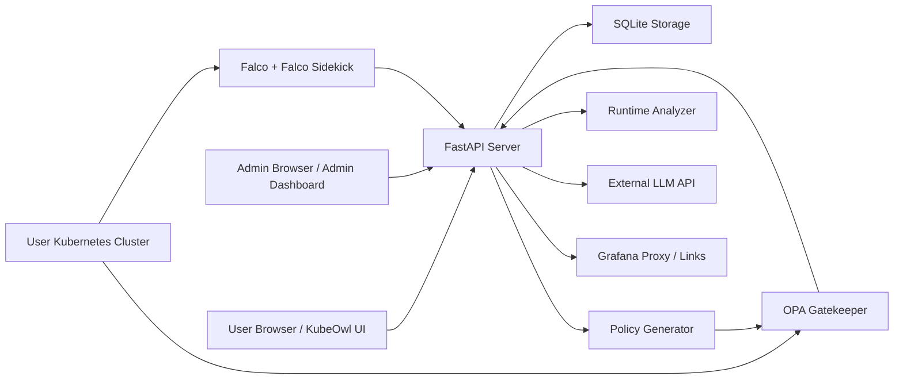
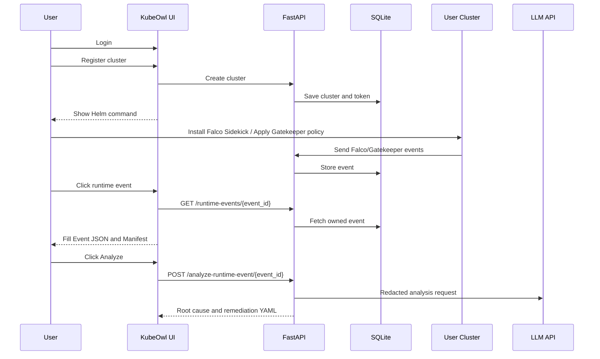

# KubeOwl Architecture Defense & 10-Minute Presentation Guide

> 이 문서는 현재 repository 코드 기준으로 발표와 교수님 질의응답을 준비하기 위한 방어 문서입니다.
> 이전 문서 내용이나 과거 구현 아이디어가 아니라, 현재 UI/Backend 흐름과 최근 수정 사항을 기준으로 작성했습니다.

## 1. 프로젝트 정의

KubeOwl은 Kubernetes 보안 운영을 위한 ComplianceOps 플랫폼입니다.

핵심 문제는 CNCF 보안 도구 자체가 부족한 것이 아니라, Falco, OPA Gatekeeper, Grafana, Slack, LLM 분석을 실제 운영자가 하나의 흐름으로 연결하기 어렵다는 점입니다. KubeOwl은 배포 전 정책 위반을 막는 Gatekeeper와 배포 후 런타임 이상행위를 탐지하는 Falco를 중앙 콘솔에 통합하고, 복잡한 이벤트를 LLM 보조 분석으로 운영 가능한 조치 가이드로 바꿉니다.

한 문장으로 말하면:

> KubeOwl은 배포 전 Admission Control과 배포 후 Runtime Detection을 하나의 보안 운영 흐름으로 묶는 Kubernetes ComplianceOps 플랫폼입니다.

## 2. 현재 코드 기준 핵심 범위

### 2.1 Policy Generator는 자유 prompt 기반이 아닙니다

현재 사용자 화면의 Policy Generator는 자연어 prompt 입력창을 노출하지 않습니다. 사용자는 dropdown에서 정책 유형을 선택하고, 프론트엔드는 선택된 정책 유형에 맞는 내부 canned prompt와 `policy_kind`를 backend로 보냅니다.

이 설계의 이유는 Kubernetes 정책의 blast radius가 크기 때문입니다. LLM이 자유롭게 YAML을 생성하면 잘못된 정책이 정상 워크로드 배포를 막거나 시스템 namespace에 영향을 줄 수 있습니다. 그래서 현재 코드는 LLM을 정책 YAML 생성자가 아니라 검토 보조자로 제한합니다.

현재 UI에 노출된 정책은 6개입니다.

| Policy Kind | 설명 | 성격 |
|---|---|---|
| `latest-tag` | latest 태그 또는 태그 누락 이미지 제한 | Gatekeeper Validate |
| `non-root` | root 권한 컨테이너 실행 제한 | Gatekeeper Validate |
| `allowed-registries` | 허용된 registry prefix만 허용 | Gatekeeper Validate |
| `host-namespace` | hostPID, hostIPC, hostNetwork 제한 | Gatekeeper Validate |
| `security-context-mutation` | securityContext 기본값 자동 주입 | Gatekeeper Mutation |
| `resource-limits-mutation` | CPU/memory limit 기본값 자동 주입 | Gatekeeper Mutation |

### 2.2 NetworkPolicy는 Policy Generator 범위에서 제거했습니다

현재 발표와 GitHub 코드 기준으로 Policy Generator에서 NetworkPolicy 생성 기능은 제외했습니다. 이유는 두 가지입니다.

1. 현재 UI dropdown에는 NetworkPolicy option이 없습니다.
2. 발표에서 보여줄 핵심은 Gatekeeper 기반 Admission Control 6개 템플릿입니다.

따라서 교수님이 "NetworkPolicy도 생성하나요?"라고 질문하면 이렇게 답하면 됩니다.

> "현재 Policy Generator의 사용자-facing 범위에서는 생성하지 않습니다. 발표 범위는 OPA Gatekeeper 기반 Validate 4종과 Mutation 2종입니다. NetworkPolicy는 별도 Kubernetes 네트워크 보안 주제라서 이번 UI 정책 생성 범위에서 제거했습니다."

주의할 점: 런타임 분석 결과가 향후 remediation 예시로 NetworkPolicy를 언급할 수 있는 것과, Policy Generator가 NetworkPolicy를 사용자 선택 정책으로 제공하는 것은 다른 문제입니다. 이번 정리는 Policy Generator 범위를 현재 UI와 일치시키기 위한 것입니다.

### 2.3 Violation Detail은 샘플 JSON이 아니라 이벤트 선택 기반입니다

최근 UX 수정의 핵심은 Violation Detail 화면을 hardcoded sample에서 실제 저장 이벤트 선택 방식으로 바꾼 것입니다.

현재 흐름:

1. 화면 최초 로드 시 Event JSON과 Resource Manifest 영역은 비어 있습니다.
2. `/runtime-events` API로 최근 runtime event 목록을 가져옵니다.
3. 사용자가 event list에서 이벤트를 클릭합니다.
4. `/runtime-events/{event_id}`로 상세 데이터를 가져옵니다.
5. Event JSON과 Resource Manifest textarea를 선택 이벤트 데이터로 자동 채웁니다.
6. Analyze 버튼을 누르면 `/analyze-runtime-event/{event_id}`를 호출합니다.

이 구조의 장점은 발표 때 명확합니다.

> "KubeOwl은 사용자가 붙여 넣은 샘플 JSON을 분석하는 데모 앱이 아니라, 저장된 runtime event를 선택하고 그 event_id를 기준으로 분석하는 운영 콘솔입니다."

### 2.4 Admin Dashboard는 Gatekeeper와 Falco 이벤트를 분리합니다

Admin Dashboard의 user detail은 total event count만 보여주지 않고, source 기준으로 이벤트를 분리합니다.

집계 기준:

```sql
SUM(CASE WHEN events.source = 'gatekeeper' THEN 1 ELSE 0 END) AS gatekeeper_events
SUM(CASE WHEN events.source IN ('sidekick', 'falco-agent') THEN 1 ELSE 0 END) AS falco_events
```

이유:

- Gatekeeper 이벤트는 Admission 단계의 정책 위반입니다.
- Falco 이벤트는 Runtime 단계의 이상행위 탐지입니다.
- 둘은 원인, 대응 방식, 운영 우선순위가 다릅니다.

교수님이 "왜 action_taken이 아니라 source로 나누었나요?"라고 물으면 이렇게 답하면 됩니다.

> "`action_taken`은 deny, alert 같은 대응 결과이고, `source`는 이벤트가 어디서 발생했는지를 나타냅니다. Gatekeeper와 Falco를 구분하려면 대응 결과가 아니라 출처 기준이 더 정확합니다."

## 3. 전체 아키텍처



### 3.1 주요 구성요소

| 구성요소 | 역할 |
|---|---|
| FastAPI server | UI 제공, API routing, 인증 context, event 분석, admin API |
| Static UI | 사용자 화면: Policy Generator, Cluster Setup, Violation Detail, AI Report |
| Admin UI | 사용자/클러스터/이벤트 집계, audit log 확인 |
| SQLite | users, clusters, events, sessions, audit logs 저장 |
| Policy Generator | 제한된 Gatekeeper policy template 생성 |
| Runtime Analyzer | 저장된 event와 manifest를 분석하고 remediation 출력 |
| LLM Client | 정책 검토 또는 runtime event 설명 보조 |
| Redaction Pipeline | LLM 전송 전 secret, token, private IP 등 민감 정보 마스킹 |
| Gatekeeper | 배포 전 admission control |
| Falco Sidekick | 런타임 이벤트를 KubeOwl ingest API로 전송 |

### 3.2 사용자 흐름



## 4. 내가 직접 판단한 설계 포인트

### 4.1 자유 prompt를 제거하고 6개 template으로 제한

AI가 YAML을 마음대로 만들면 demo는 멋있어 보일 수 있지만, 보안 운영에서는 위험합니다. Kubernetes admission policy는 잘못 적용되면 배포 장애를 만들 수 있습니다. 그래서 사용자는 dropdown으로 정책 유형을 선택하고, backend는 검증된 template을 생성합니다.

이것은 단순 기능 축소가 아니라 보안 설계입니다.

### 4.2 LLM은 생성자가 아니라 reviewer/analyzer

정책 생성에서 LLM은 YAML을 최종 생성하지 않습니다. 서버가 template을 만들고, LLM은 review note를 보조합니다.

런타임 분석에서도 LLM은 event 해석과 remediation 설명을 돕지만, 민감 정보 redaction 이후에만 호출됩니다. LLM 실패 시에도 fallback 분석 결과가 유지되도록 설계했습니다.

### 4.3 event_id 기반 분석

Violation Detail에서 사용자가 임의 JSON을 붙여 넣는 방식은 데모용으로는 쉽지만, 운영 시스템으로는 약합니다. 현재 구조는 저장된 이벤트를 클릭하고, 선택된 event_id를 기준으로 `/analyze-runtime-event/{event_id}`를 호출합니다.

장점:

- 사용자 소유 cluster 이벤트인지 backend에서 확인할 수 있습니다.
- 실제 저장된 event와 manifest snapshot을 분석합니다.
- 화면 초기 상태가 hardcoded sample에 의존하지 않습니다.

### 4.4 Admin metric 분리

total event count 하나만 보여주면 운영자가 문제를 빠르게 판단하기 어렵습니다. 그래서 Gatekeeper(Admission)과 Falco(Runtime)를 분리했습니다. 이 결정은 UI 표현뿐 아니라 SQL aggregation도 source 기준으로 바꾼 것입니다.

## 5. [Demo Guide] 데모 영상 흐름

아래 순서대로 녹화하면 10분 발표에서 자연스럽게 연결됩니다. 코드를 설명하지 말고, 운영자 user journey를 보여주는 것이 핵심입니다.

### 1. 비로그인 접근 (Public)

- 시크릿 모드 또는 로그아웃 상태로 KubeOwl 메인 화면에 접속합니다.
- Policy Generator 탭을 보여줍니다.
- Policy Type dropdown만 간단히 열어 보여줍니다.
- 실제 클러스터 Apply나 Violation 분석은 로그인 후 가능하다고 설명합니다.

화면에서 말할 포인트:

> "KubeOwl은 비로그인 사용자에게도 정책 생성 기능 일부를 공개합니다. 하지만 실제 클러스터 적용이나 위반 로그 분석은 사용자 클러스터와 연결되어야 하므로 로그인이 필요합니다."

### 2. 로그인 및 기초 세팅 (User)

- Google Login을 클릭합니다.
- 사용자 화면으로 들어간 뒤 Cluster Setup 탭으로 이동합니다.
- 미리 등록한 `demo-prod-cluster`를 보여줍니다.
- Falco Sidekick Helm install command가 자동 생성되는 화면을 보여줍니다.
- Slack 연동 또는 alert forwarding 설정이 있으면 같이 보여줍니다.

화면에서 말할 포인트:

> "로그인 후 인프라 담당자는 먼저 자신의 클러스터를 등록합니다. 여기서는 미리 등록해 둔 `demo-prod-cluster`를 사용합니다. KubeOwl은 이 화면에서 Falco Sidekick 설치용 Helm 명령과 Slack 연동 흐름을 제공합니다."

### 3. 중앙 통제 확인 (Admin)

- 새 탭에서 `/admin`으로 이동합니다.
- 관리자 토큰을 입력하거나 이미 열린 admin 화면을 사용합니다.
- 방금 로그인한 사용자와 `demo-prod-cluster`가 보이는지 확인합니다.
- 하단 Audit Log에서 login, cluster creation 같은 행위가 추적되는 것을 보여줍니다.
- User Detail에서 Gatekeeper(Admission), Falco(Runtime) metric이 분리되어 있는지 짚습니다.

화면에서 말할 포인트:

> "관리자 시점에서는 사용자와 클러스터가 중앙 대시보드에 즉시 연결됩니다. 또 Audit Log를 통해 로그인, 클러스터 생성 같은 운영 행위가 추적됩니다. 이벤트 metric도 total 하나가 아니라 Gatekeeper와 Falco로 분리됩니다."

### 4. 사전 방어 (Gatekeeper)

- 사용자 화면으로 돌아갑니다.
- Policy Generator 탭을 엽니다.
- Policy Type에서 `non-root` 강제 정책을 선택합니다.
- Constraint name을 확인하고 정책을 생성합니다.
- 생성된 ConstraintTemplate과 Constraint YAML을 보여줍니다.
- `demo-prod-cluster`에 Apply합니다.
- 적용 성공 메시지를 확인합니다.

화면에서 말할 포인트:

> "이 단계는 사전 방어입니다. non-root 강제 정책을 생성하고 방금 등록한 클러스터에 적용합니다. 이후 규정에 맞지 않는 root container 리소스는 Gatekeeper admission 단계에서 차단됩니다."

### 5. 런타임 탐지 및 AI 분석 (Violation) - 하이라이트

- Violation Detail 탭으로 이동합니다.
- Event JSON과 Resource Manifest 영역이 처음에는 비어 있거나 선택 전 상태임을 보여줍니다.
- 최근 이벤트 목록에서 `payments-prod` namespace의 Critical event를 클릭합니다.
- 이벤트 이름은 `Read sensitive file untrusted`를 사용합니다.
- 클릭 후 Event JSON과 Resource Manifest가 자동으로 채워지는 것을 보여줍니다.
- `AI 분석` 또는 Analyze 버튼을 클릭합니다.
- 분석 결과에서 원인, severity, remediation YAML snippet을 보여줍니다.
- `runAsNonRoot: true` 같은 조치 예시를 강조합니다.

화면에서 말할 포인트:

> "사전 방어를 통과했더라도 런타임에서 이상 행위가 발생할 수 있습니다. 이 이벤트는 Falco가 탐지한 Critical 알람입니다. 운영자가 복잡한 JSON을 직접 해석하지 않아도, AI가 원인과 수정 방향을 요약하고 `runAsNonRoot: true` 같은 조치용 YAML snippet을 제공합니다."

### 6. 종합 보고 및 시각화 (AI Report & Grafana)

- AI Report 탭으로 이동합니다.
- Report Generate 버튼을 클릭합니다.
- 전체 이벤트 metadata를 기반으로 취약 namespace와 pod 요약을 보여줍니다.
- 미리 주입한 2개 namespace와 3개 pod 수치가 깔끔하게 표시되는지 확인합니다.
- 시간이 남으면 Grafana 화면 또는 링크를 보여줍니다.

화면에서 말할 포인트:

> "마지막은 주간 보안 회의용 보고 흐름입니다. AI Report는 개별 이벤트가 아니라 전체 이벤트 metadata를 종합해 어떤 namespace와 pod가 취약한지 요약합니다. 운영자는 이 결과를 회의나 후속 조치 우선순위 결정에 사용할 수 있습니다."

## 6. [Spoken Script] 10분 발표 대본

아래 대본은 실제 발표에서 자연스럽게 말할 수 있도록 구성했습니다. 시간을 맞추기 위해 코드 세부 설명보다 문제, 사용자 흐름, 설계 판단을 중심으로 말합니다.

### 0:00-0:40 시작

안녕하세요. 저는 Kubernetes 보안 운영을 위한 ComplianceOps 플랫폼, KubeOwl을 발표하겠습니다.

KubeOwl의 목표는 단순히 보안 이벤트를 보여주는 것이 아닙니다. 배포 전에는 OPA Gatekeeper로 위험한 리소스를 막고, 배포 후에는 Falco로 runtime 이상행위를 탐지하고, 복잡한 로그는 LLM 보조 분석으로 운영자가 바로 이해할 수 있는 조치 가이드로 바꾸는 것입니다.

### 0:40-2:20 문제 정의와 목표

클라우드 네이티브 환경에는 이미 좋은 보안 도구가 많습니다. Falco, Gatekeeper, Grafana, Slack 같은 도구들이 대표적입니다.

하지만 실제 운영에서는 이 도구들을 함께 쓰는 것이 어렵습니다. 정책 YAML은 따로 관리해야 하고, runtime alert는 다른 화면에서 확인해야 하고, 이벤트가 많아지면 어떤 알람을 먼저 봐야 하는지 판단하기 어렵습니다. 이 문제를 alert fatigue라고도 부를 수 있습니다.

KubeOwl은 이 문제를 하나의 운영 흐름으로 묶기 위해 만들었습니다. 개발자나 인프라 담당자가 클러스터를 등록하고, 보안 정책을 생성하고, 위반 이벤트를 확인하고, AI 분석 결과를 통해 remediation YAML까지 확인할 수 있게 하는 것이 핵심입니다.

여기서 제가 중요하게 생각한 점은 AI를 무조건 자동화 엔진으로 쓰지 않는 것입니다. 특히 Kubernetes 정책은 잘못 적용되면 정상 서비스 배포까지 막을 수 있습니다. 그래서 KubeOwl은 AI를 보조 분석자와 reviewer로 사용하고, 실제 정책 생성은 제한된 template 기반으로 설계했습니다.

### 2:20-3:10 Demo Step 1: 비로그인 접근

먼저 비로그인 상태의 화면부터 보겠습니다.

KubeOwl은 비로그인 사용자에게도 Policy Generator 기능 일부를 보여줄 수 있습니다. 여기서 정책 유형 dropdown을 보면 사용자가 어떤 보안 정책을 만들 수 있는지 확인할 수 있습니다.

다만 실제 클러스터에 정책을 적용하거나, 저장된 위반 로그를 분석하는 기능은 로그인 후에만 가능합니다. 그 이유는 클러스터 소유권과 event ownership을 확인해야 하기 때문입니다. 즉, 공개 기능과 실제 운영 기능을 분리했습니다.

### 3:10-4:00 Demo Step 2: 로그인 및 클러스터 세팅

이제 Google Login으로 로그인하겠습니다.

로그인 후 인프라 담당자가 가장 먼저 하는 일은 자신의 Kubernetes 클러스터를 등록하는 것입니다. 여기서는 미리 등록해 둔 `demo-prod-cluster`를 사용하겠습니다.

Cluster Setup 화면을 보면 KubeOwl이 Falco Sidekick 설치용 Helm command를 생성해 줍니다. 이 명령에는 cluster를 식별하기 위한 token이 포함됩니다. Falco Sidekick은 runtime event를 KubeOwl의 ingest API로 보내고, 서버는 token을 통해 어느 사용자의 어느 클러스터에서 온 이벤트인지 구분합니다.

Slack 연동 기능도 이 흐름 안에 포함되어 있습니다. 운영자는 탐지 이벤트를 KubeOwl에서 보고, 필요하면 Slack alert 흐름으로도 연결할 수 있습니다.

### 4:00-4:50 Demo Step 3: Admin 중앙 통제

잠시 관리자 시점으로 보겠습니다.

새 탭에서 `/admin`으로 들어가면 사용자와 클러스터 정보를 중앙에서 확인할 수 있습니다. 방금 로그인한 사용자와 `demo-prod-cluster`가 관리자 화면에도 연결되어 있는 것을 볼 수 있습니다.

또 Audit Log에서는 로그인, 클러스터 생성 같은 행위가 기록됩니다. 이 부분은 단순 기능 확인을 넘어서, 누가 어떤 운영 행위를 했는지 추적하기 위한 부분입니다.

User Detail에서는 이벤트 metric도 분리되어 있습니다. Gatekeeper는 Admission 단계의 정책 위반이고, Falco는 Runtime 단계의 탐지 이벤트입니다. 그래서 total 하나로 합치지 않고 `source` 기준으로 Gatekeeper와 Falco count를 나누었습니다.

### 4:50-6:00 Demo Step 4: 사전 방어 Gatekeeper

이제 사용자 화면으로 돌아와서 사전 방어 흐름을 보겠습니다.

Policy Generator에서 `non-root` 강제 정책을 선택합니다. 여기서 중요한 점은 자유 prompt 입력창이 없다는 것입니다. 사용자는 임의 문장을 넣는 것이 아니라, 정해진 6개의 정책 template 중 하나를 선택합니다.

제가 이렇게 설계한 이유는 Kubernetes 정책의 영향 범위가 크기 때문입니다. 잘못된 admission policy는 정상 workload까지 막을 수 있습니다. 그래서 LLM에게 YAML 생성을 맡기지 않고, backend가 검증된 Gatekeeper template을 생성하도록 했습니다.

정책을 생성하면 ConstraintTemplate과 Constraint YAML이 표시됩니다. 이제 이 정책을 `demo-prod-cluster`에 적용합니다. 적용 성공 메시지가 뜨면, 이후 root 권한으로 실행되는 container 같은 규정 위반 리소스는 Gatekeeper admission 단계에서 차단됩니다.

### 6:00-7:30 Demo Step 5: 런타임 탐지와 AI 분석

다음은 KubeOwl에서 가장 중요한 부분인 runtime violation 분석입니다.

Violation Detail 화면으로 이동하면 최근 runtime event 목록이 있습니다. 예전처럼 sample JSON이 미리 박혀 있는 것이 아니라, 이벤트를 선택해야 Event JSON과 Resource Manifest가 채워지는 구조입니다.

여기서는 `payments-prod` namespace에서 발생한 Critical 이벤트, `Read sensitive file untrusted`를 클릭하겠습니다.

클릭하면 Event JSON 영역이 자동으로 채워집니다. Resource Manifest snapshot이 있으면 함께 채워집니다. 운영자는 이 복잡한 JSON을 직접 처음부터 해석할 필요가 없습니다.

이제 AI 분석 버튼을 누릅니다. 이때 frontend는 선택된 event_id를 기준으로 `/analyze-runtime-event/{event_id}` API를 호출합니다. backend는 저장된 이벤트와 manifest를 가져오고, 민감 정보는 redaction pipeline을 거친 뒤 분석합니다.

분석 결과에는 원인, 심각도, 권장 조치, 그리고 remediation YAML snippet이 표시됩니다. 예를 들어 container가 root로 실행될 위험이 있으면 `runAsNonRoot: true` 같은 수정 방향을 제안할 수 있습니다.

이 기능의 핵심은 AI가 보안 담당자를 대체하는 것이 아니라, 복잡한 Falco log를 사람이 빠르게 이해할 수 있는 조치 단위로 변환한다는 점입니다.

### 7:30-8:20 Demo Step 6: AI Report와 Grafana

마지막으로 AI Report 흐름입니다.

개별 이벤트 분석은 incident 대응에 가깝습니다. 반면 AI Report는 주간 보안 회의나 운영 리포트에 가까운 기능입니다. Report Generate를 누르면 전체 이벤트 metadata를 종합해서 어떤 namespace와 pod에서 문제가 많이 발생했는지 요약합니다.

여기서는 미리 준비한 2개 namespace와 3개 pod 기준의 수치를 보여주겠습니다. 운영자는 개별 JSON을 하나씩 보지 않아도, 어느 영역이 가장 취약한지 우선순위를 잡을 수 있습니다.

시간이 되면 Grafana 화면도 같이 보여줄 수 있습니다. Grafana는 metric 시각화 쪽에 강점이 있고, KubeOwl은 그 위반 이벤트를 운영 action으로 연결하는 쪽에 집중합니다.

### 8:20-9:30 Engineering Decisions

이 프로젝트에서 제가 가장 신경 쓴 부분은 AI를 어디에 쓰고 어디에서 제한할지였습니다.

첫 번째 결정은 자유 prompt를 제거한 것입니다. 사용자가 원하는 문장을 넣고 LLM이 Kubernetes policy를 만들어 주는 방식은 데모로는 좋아 보일 수 있습니다. 하지만 실제 운영에서는 위험합니다. 정책 하나가 잘못되면 정상 서비스 배포까지 막을 수 있습니다. 그래서 저는 6개의 사전 정의된 policy template만 UI에 노출했습니다.

두 번째 결정은 LLM 전송 전 redaction pipeline입니다. Runtime event와 manifest에는 private IP, registry URL, secret-like token, 환경변수 값이 들어갈 수 있습니다. 이 데이터를 그대로 외부 LLM API에 보내면 보안 분석 기능이 정보 유출 경로가 될 수 있습니다. 그래서 backend에서 민감 정보를 placeholder로 마스킹한 뒤 분석하도록 설계했습니다.

세 번째 결정은 Admin metric을 `source` 기준으로 나눈 것입니다. Gatekeeper와 Falco는 둘 다 보안 이벤트지만 의미가 다릅니다. Gatekeeper는 배포 전 admission 문제이고, Falco는 배포 후 runtime 문제입니다. 그래서 운영자가 바로 원인을 구분할 수 있도록 Gatekeeper(Admission)과 Falco(Runtime)를 분리했습니다.

### 9:30-10:00 결론

정리하면 KubeOwl은 CNCF 보안 도구를 하나의 운영 흐름으로 연결하는 ComplianceOps 플랫폼입니다.

이 프로젝트를 하면서 배운 점은, AI를 붙이는 것 자체보다 AI를 안전하게 제한하는 설계가 더 중요하다는 것입니다. 저는 제한된 환경에서 FastAPI, SQLite, 정적 UI로 단순한 구조를 유지하면서도, 클러스터 소유권, 이벤트 선택 기반 분석, 민감 정보 redaction, Gatekeeper/Falco metric 분리를 구현했습니다.

KubeOwl의 핵심 가치는 자동화와 통제의 균형입니다. 운영자의 피로도를 줄이되, 보안 판단과 정책 적용은 검토 가능한 흐름 안에 두는 것이 이 프로젝트의 목표입니다.

## 7. 예상 질문과 답변

### Q1. 어떤 부분을 직접 설계했나요?

요구사항을 CNCF 도구 흐름에 맞게 나누고, 사용자 UX를 제한된 template 기반으로 설계했습니다. 특히 자유 prompt 제거, 6개 정책 template 제한, event_id 기반 runtime 분석, LLM redaction pipeline, Admin metric source 분리는 직접 판단한 설계 포인트입니다.

### Q2. AI가 대부분 만들었다면 본인의 기여는 무엇인가요?

AI는 구현 속도를 높이는 도구로 사용했습니다. 제가 담당한 부분은 문제 정의, 기능 범위 결정, 위험한 UX 제거, API 흐름 선택, 검증 기준 설정입니다. 예를 들어 LLM에게 정책 YAML 생성을 모두 맡기지 않고 template 기반으로 제한한 것은 프로젝트의 핵심 설계 결정입니다.

### Q3. 왜 Policy Generator에 자유 prompt를 두지 않았나요?

Kubernetes policy는 잘못 생성되면 영향 범위가 큽니다. 그래서 사용자가 자유롭게 입력한 문장을 LLM이 해석해 YAML을 만드는 방식은 위험하다고 판단했습니다. 현재는 사용자가 policy type을 선택하고, backend가 검증된 template을 생성합니다.

### Q4. Gatekeeper와 Falco의 차이는 무엇인가요?

Gatekeeper는 Kubernetes API admission 단계에서 리소스 생성/수정을 검사합니다. 즉 배포 전 방어입니다. Falco는 컨테이너가 실행된 이후 syscall 기반으로 이상행위를 탐지합니다. 즉 배포 후 runtime detection입니다.

### Q5. 왜 Admin metric을 Gatekeeper와 Falco로 나눴나요?

Admission 문제와 Runtime 문제는 대응 방식이 다릅니다. total count만 있으면 운영자가 어디서 문제가 발생했는지 알기 어렵습니다. 그래서 events table의 `source` 컬럼을 기준으로 `gatekeeper_events`와 `falco_events`를 분리했습니다.

### Q6. LLM에 민감 정보가 넘어가지 않나요?

runtime event 분석 전 backend redaction pipeline을 거칩니다. secret, token, api key, password, private IP, 민감한 registry 정보 등을 placeholder로 치환한 뒤 LLM 요청에 사용합니다. LLM이 분석에 필요한 구조는 유지하되 민감한 원문 값은 숨깁니다.

### Q7. LLM이 실패하면 기능이 멈추나요?

멈추지 않도록 설계했습니다. 정책 생성은 template 결과가 유지되고, runtime 분석도 rule-based fallback이 가능합니다. LLM은 보조 기능이므로 실패해도 핵심 UI가 빈 화면이 되지 않도록 했습니다.

### Q8. 왜 SQLite를 사용했나요?

발표와 단일 서버 데모 환경에서는 SQLite가 단순하고 충분합니다. 다만 대규모 운영에서는 PostgreSQL로 전환하는 것이 더 적합합니다. 이 부분은 명확한 개선 방향입니다.

## 8. 발표 전 체크리스트

1. 비로그인 또는 시크릿 모드에서 `/ui` 접속 확인
2. Policy Generator dropdown 6개 정책 확인
3. NetworkPolicy option이 없는지 확인
4. Google Login 흐름 확인
5. `demo-prod-cluster`가 Cluster Setup에 보이는지 확인
6. Helm command와 Slack 연동 화면 확인
7. `/admin`에서 사용자, cluster, audit log 확인
8. Admin user detail에서 Gatekeeper(Admission), Falco(Runtime) 분리 metric 확인
9. Policy Generator에서 `non-root` 생성 및 apply 성공 메시지 확인
10. Violation Detail에서 `Read sensitive file untrusted` 이벤트 클릭 확인
11. Event JSON과 Resource Manifest 자동 채움 확인
12. AI 분석 결과와 remediation YAML snippet 확인
13. AI Report에서 namespace/pod summary 확인
14. Grafana 화면은 네트워크 상태가 좋을 때만 보조로 사용

## 9. 검증 명령

핵심 API/UI regression 확인:

```bash
.venv/bin/python -m pytest \
  ai-observability/ai-server/tests/test_api.py::test_generate_policy_contract \
  ai-observability/ai-server/tests/test_api.py::test_generate_mutation_policy_contract \
  ai-observability/ai-server/tests/test_api.py::test_generate_policy_rejects_unsupported_prompt_with_examples \
  ai-observability/ai-server/tests/test_api.py::test_generate_policy_rejects_network_policy_prompt \
  ai-observability/ai-server/tests/test_api.py::test_llm_partial_review_is_completed \
  ai-observability/ai-server/tests/test_api.py::test_ui_is_served \
  ai-observability/ai-server/tests/test_api.py::test_docs_is_served \
  -q
```

프론트엔드 JavaScript syntax 확인:

```bash
node --check ai-observability/ai-server/app/static/app.js
```

## 10. 현재 한계와 다음 개선 방향

- SQLite는 데모와 단일 인스턴스에는 적합하지만, 운영 확장에는 PostgreSQL이 더 적합합니다.
- Gatekeeper ingest 인증은 Falco Sidekick token 흐름처럼 더 강화할 수 있습니다.
- Admin Dashboard에는 현재 분리 metric이 있지만, source/severity/rule/date range filter를 추가하면 운영성이 더 좋아집니다.
- LLM 분석 결과는 계속 schema validation과 redaction rule을 강화해야 합니다.
- Grafana는 시각화 보조 역할이고, KubeOwl 내부 report와 incident workflow를 더 강화할 여지가 있습니다.
